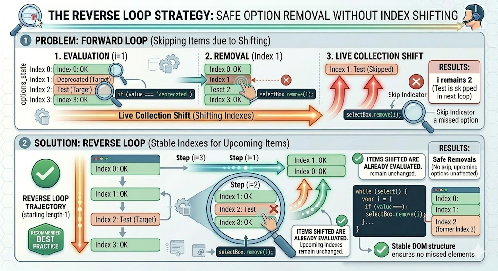

# JavaScript DOM — Removing Options Conditionally

## Complete Guide with Full HTML Examples

### Table of Contents

* [The Live Index Shifting Trap](https://www.google.com/search?q=%231-the-live-index-shifting-trap)
* [Pattern A: Forward Loop with Index Pointer Decrementing](https://www.google.com/search?q=%232-pattern-a-forward-loop-with-index-pointer-decrementing)
* [Pattern B: The Reverse Loop Strategy (Recommended Best Practice)](https://www.google.com/search?q=%233-pattern-b-the-reverse-loop-strategy-recommended-best-practice)
* [Pattern C: Array Conversion Filtering (Modern Declarative Approach)](https://www.google.com/search?q=%234-pattern-c-array-conversion-filtering-modern-declarative-approach)
* [Full Integration Sandbox Demo](https://www.google.com/search?q=%235-full-integration-sandbox-demo)
* [Quick Reference Table](https://www.google.com/search?q=%23quick-reference-table)

---

### 1. The Live Index Shifting Trap

When evaluating and removing `<option>` elements from a dropdown menu based on custom logic (such as text length, matching prefixes, or specific data properties), developers frequently encounter a common pitfall: the **Live Index Shifting Trap**.

The `select.options` collection is a **live list**. When you call `select.remove(index)` on an item, that specific option is instantly dropped from the DOM tree, causing all subsequent items to shift left (upward) by one position to fill the void.

#### Detailed Failure Mechanics Breakdown

Suppose you have three options in a dropdown menu:

| Index | Value | Text |
| --- | --- | --- |
| **0** | `A` | Item A |
| **1** | `B` | Item B |
| **2** | `C` | Item C |

If your conditional loop targets items `B` and `C` using a standard, uncorrected forward loop (`for (let i = 0; i < select.options.length; i++)`):

1. **Iteration 1 (`i = 0`):** Checks index `0` (`A`). Does not meet the condition. Moving on.
2. **Iteration 2 (`i = 1`):** Checks index `1` (`B`). Condition met! `select.remove(1)` is executed.
3. **The Trap Steps In:** Item `B` is deleted. Item `C` instantly moves from index `2` into index `1`. The loop's internal counter increments `i` to `2`.
4. **Iteration 3 (`i = 2`):** The loop looks for index `2`. However, index `2` no longer exists because item `C` shifted to index `1`. The loop finishes, and item `C` is completely skipped.

---

### 2. Pattern A: Forward Loop with Index Pointer Decrementing

To fix this problem while still using a standard forward-loop, you must manually decrement the loop counter variable (`i--`) immediately after a removal occurs. This adjustment pulls the pointer back to match the shifted index position, ensuring no elements are skipped in the next step:

```javascript
const selectBox = document.querySelector('#framework-list');

for (let i = 0; i < selectBox.options.length; i++) {
    const optionText = selectBox.options[i].text.toLowerCase();
    
    // Condition: Target options that contain the term "legacy"
    if (optionText.includes('legacy')) {
        selectBox.remove(i); 
        
        i--; // Adjust pointer backwards to balance the live collection shift
    }
}

```

---

### 3. Pattern B: The Reverse Loop Strategy (Recommended Best Practice)

The cleanest imperative approach to avoid this shifting issue altogether is to **loop backwards** through the collection, starting from the last index (`length - 1`) and moving down to `0`.

When you remove an option while looping in reverse, the items that shift are the ones you have *already* evaluated. The index positions of the remaining items earlier in the loop stay exactly where they are.



```javascript
const selectBox = document.querySelector('#framework-list');

// Initialize pointer at the final item index and iterate downwards
let i = selectBox.options.length;

while (i--) {
    const optionValue = selectBox.options[i].value;
    
    // Condition: Remove choices matching explicit data keys
    if (optionValue === 'deprecated' || optionValue === 'test') {
        selectBox.remove(i); // Safe removal; upcoming indexes remain unchanged
    }
}

```

---

### 4. Pattern C: Array Conversion Filtering (Modern Declarative Approach)

If you prefer a more modern, declarative code style, you can avoid direct index tracking entirely. First, convert the array-like `select.options` collection into a true JavaScript array using **`Array.from()`**.

This gives you access to native array methods like `.filter()`, allowing you to safely isolate elements and call `.remove()` directly on the nodes without worrying about index counters:

```javascript
const selectBox = document.querySelector('#framework-list');

// Step 1: Create a static, un-shifting array of the option elements
const stableOptionsArray = Array.from(selectBox.options);

// Step 2: Filter and process items using a declarative loop
stableOptionsArray
    .filter(option => option.text.endsWith('(Inverted)'))
    .forEach(option => option.remove()); // Directly calls the node removal interface

```

---

### 5. Full Integration Sandbox Demo

This standalone HTML playground file lets you see conditional removal methods in action. It loads a list of web frameworks and provides control triggers to filter items based on conditions, using an active logging terminal to show how index paths update in real-time.

```html
<!DOCTYPE html>
<html lang="en">
<head>
    <meta charset="UTF-8">
    <meta name="viewport" content="width=device-width, initial-scale=1.0">
    <title>Conditional Option Purging Laboratory</title>
    <style>
        body { font-family: Arial, sans-serif; padding: 25px; background-color: #f8fafc; color: #0f172a; }
        .grid { display: grid; grid-template-columns: 1fr 1fr; gap: 25px; max-width: 1100px; margin: 0 auto; }
        .card { border: 1px solid #e2e8f0; padding: 25px; border-radius: 8px; background: #ffffff; box-shadow: 0 4px 6px rgba(0,0,0,0.02); }
        
        label { display: block; margin-bottom: 8px; font-weight: bold; font-size: 14px; }
        select[multiple] { width: 100%; height: 160px; padding: 10px; font-size: 15px; border: 2px solid #cbd5e1; border-radius: 6px; box-sizing: border-box; background: #fff; outline: none; }
        
        .btn-stack { display: flex; flex-direction: column; gap: 10px; margin-top: 15px; }
        .action-btn { width: 100%; padding: 11px; font-weight: bold; border-radius: 6px; border: none; cursor: pointer; font-size: 14px; color: white; transition: background 0.2s; }
        .btn-blue { background-color: #2563eb; }
        .btn-blue:hover { background-color: #1d4ed8; }
        .btn-purple { background-color: #7c3aed; }
        .btn-purple:hover { background-color: #6d28d9; }
        .btn-reset { background-color: #64748b; }
        .btn-reset:hover { background-color: #475569; }
        
        pre { background: #0f172a; color: #f8fafc; padding: 15px; border-radius: 6px; font-size: 13px; font-family: monospace; min-height: 200px; white-space: pre-wrap; margin: 0; }
    </style>
</head>
<body>

    <h1 style="text-align: center; margin-bottom: 30px;">Conditional Option Purging Laboratory</h1>
    
    <div class="grid">
        <div class="card">
            <label for="framework-select">Interactive Framework Targets</label>
            <select id="framework-select" multiple>
                <option value="1">Angular</option>
                <option value="2">React</option>
                <option value="3">Vue.js</option>
                <option value="4">Ember.js</option>
                <option value="5">Svelte</option>
                <option value="6">Next.js</option>
            </select>
            
            <div class="btn-stack">
                <button type="button" id="btn-purge-js" class="action-btn btn-blue">
                    Remove Items Ending in ".js" (Uses Reverse Loop)
                </button>
                <button type="button" id="btn-purge-short" class="action-btn btn-purple">
                    Remove Items under 7 Characters (Uses Pointer Correction)
                </button>
                <button type="button" id="btn-reload-dataset" class="action-btn btn-reset">
                    Reload Baseline Demo Options
                </button>
            </div>
        </div>

        <div class="card">
            <h3>Live Telemetry Terminal</h3>
            <pre id="diagnostic-terminal">Awaiting testing execution inputs...</pre>
        </div>
    </div>

    <script>
        const selectElement = document.getElementById('framework-select');
        const terminal = document.getElementById('diagnostic-terminal');

        // Static baseline map array used for reloading components
        const backupDataset = [
            { val: "1", txt: "Angular" },
            { val: "2", txt: "React" },
            { val: "3", txt: "Vue.js" },
            { val: "4", txt: "Ember.js" },
            { val: "5", txt: "Svelte" },
            { val: "6", txt: "Next.js" }
        ];

        // --- Utility function to update telemetry report text ---
        function runDiagnostics(actionTitle) {
            const currentOptions = Array.from(selectElement.options);
            let mapReport = currentOptions.map((opt, i) => `  [Index ${i}] -> Value: "${opt.value}" | Text: "${opt.text}"`).join('\n');
            
            terminal.textContent = `[Action Log Output]: ${actionTitle}\n` +
                `------------------------------------------------------------\n` +
                `• Total Item Length Counter: ${selectElement.options.length}\n\n` +
                `Current Layout Map Tree:\n${mapReport || "  (The select element is empty)"}`;
        }

        // --- 1. Condition Strategy: Reverse Loop (Ends with '.js') ---
        document.getElementById('btn-purge-js').addEventListener('click', () => {
            let indexPointer = selectElement.options.length;
            let targetCounter = 0;

            while (indexPointer--) {
                const textValue = selectElement.options[indexPointer].text;
                
                if (textValue.toLowerCase().endsWith('.js')) {
                    selectElement.remove(indexPointer);
                    targetCounter++;
                }
            }
            runDiagnostics(`Reverse Loop removed ${targetCounter} item(s) matching criteria (*.js)`);
        });

        // --- 2. Condition Strategy: Forward Loop with Correction (< 7 Chars) ---
        document.getElementById('btn-purge-short').addEventListener('click', () => {
            let targetCounter = 0;

            for (let i = 0; i < selectElement.options.length; i++) {
                const textValue = selectElement.options[i].text;

                if (textValue.length < 7) {
                    selectElement.remove(i);
                    targetCounter++;
                    
                    // CRITICAL: Step counter back by one to capture the shifted item position
                    i--; 
                }
            }
            runDiagnostics(`Forward Loop with pointer correction removed ${targetCounter} short item(s)`);
        });

        // --- 3. Utility Strategy: Resetting Layout Data ---
        document.getElementById('btn-reload-dataset').addEventListener('click', () => {
            // Clear current list content
            selectElement.options.length = 0;

            // Repopulate using the static backup array layout
            backupDataset.forEach(item => {
                selectElement.add(new Option(item.txt, item.val), undefined);
            });

            runDiagnostics("Successfully reloaded standard dataset entries.");
        });

        // Run baseline analytics upon page launch
        runDiagnostics("Laboratory environment ready.");
    </script>
</body>
</html>

```

---

### Quick Reference Table

| Code Implementation Strategy | Essential Mechanics Pattern | Primary Practical Advantage | Critical Structural Disadvantage |
| --- | --- | --- | --- |
| **`while (i--)` (Reverse Loop)** | Starts at `length - 1` and counts backward down to `0`. | **Highly Recommended.** Safely bypasses the live index-shifting trap since shifting only affects already processed elements. | Reverse processing orientation order can feel unintuitive compared to traditional forward loops. |
| **`for (i++)` with `i--` Correction** | Loops forward through items, but manually subtracts `1` whenever an option is deleted. | Allows you to maintain a standard, forward-reading loop structure. | Requires manual pointer correction (`i--`); forgetting this line introduces silent bugs where elements are skipped. |
| **`Array.from().filter()`** | Converts the live options collection into a static, unchanging array copy. | Clean, modern, declarative code pattern. Avoids direct index tracking entirely. | Creates a short-lived array copy in memory, though this has negligible performance impact for standard forms. |

---