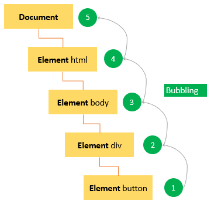
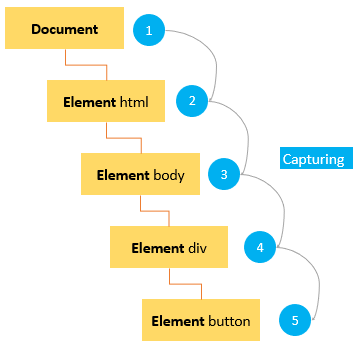
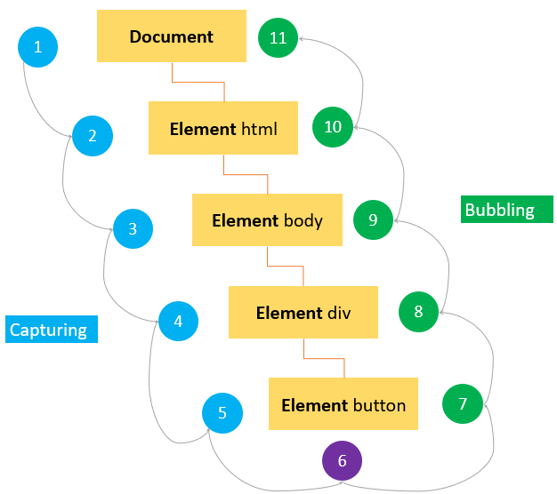

# Events & Event Flow

## Complete Guide with Full HTML Examples

### Table of Contents

* [Introduction to JavaScript Events](https://www.google.com/search?q=%231-introduction-to-javascript-events)
* [Event Flow: Bubbling vs. Capturing](https://www.google.com/search?q=%232-event-flow-bubbling-vs-capturing)
* [DOM Level 2 Event Flow (The 3 Phases)](https://www.google.com/search?q=%233-dom-level-2-event-flow-the-3-phases)
* [The Event Object & Vital Properties](https://www.google.com/search?q=%234-the-event-object--vital-properties)
* [Controlling Event Behavior: preventDefault() & stopPropagation()](https://www.google.com/search?q=%235-controlling-event-behavior-preventdefault--stoppropagation)
* [Quick Reference Table](https://www.google.com/search?q=%23quick-reference-table)

---

### 1. Introduction to JavaScript Events

#### What is it?

An **event** is a signal or an action that occurs inside the web browser window (such as a user clicking a button, moving a mouse, filling out a form, or the page finishing loading). You can write code to react to these specific triggers using an **event handler** (also known as an **event listener**), which is a function that executes automatically when the specified event fires.

#### How it works

1. Target and select the DOM element you want to watch.
2. Call the `addEventListener()` method on that element.
3. Pass two main arguments: the event name as a string (e.g., `'click'`) and the callback function to execute.
4. When the browser registers that action on the element, it runs your function.

#### Syntax

```javascript
element.addEventListener(eventType, handlerFunction);

```

#### Syntax Variations

You can attach event handlers in a few structurally distinct ways depending on your coding preferences:

##### 1. Named Reference Function

```javascript
function handleClick() {
    alert('Element clicked!');
}
btn.addEventListener('click', handleClick);

```

##### 2. Anonymous Function Inline

```javascript
btn.addEventListener('click', function() {
    alert('Element clicked inline!');
});

```

##### 3. Modern Arrow Function

```javascript
btn.addEventListener('click', () => {
    alert('Element clicked via arrow syntax!');
});

```

#### Full HTML Example — Registering Event Handlers

```html
<!DOCTYPE html>
<html lang="en">
<head>
    <meta charset="UTF-8">
    <title>JS Event Registration Demo</title>
    <style>
        body { font-family: Arial, sans-serif; padding: 20px; }
        .box { border: 1px solid #bdc3c7; padding: 15px; margin: 15px 0; border-radius: 6px; }
        button { padding: 10px 20px; font-size: 14px; cursor: pointer; margin-right: 10px; }
        pre { background: #2c3e50; color: #ecf0f1; padding: 12px; border-radius: 4px; }
    </style>
</head>
<body>
    <h1>Registering Event Listeners</h1>

    <div class="box">
        <button id="btn-named">Named Handler</button>
        <button id="btn-anon">Anonymous Handler</button>
        <button id="btn-arrow">Arrow Handler</button>
        
        <h3>Action Tracker Console</h3>
        <pre id="event-log">Waiting for user interaction...</pre>
    </div>

    <script>
        const log = document.getElementById('event-log');
        
        const btnNamed = document.getElementById('btn-named');
        const btnAnon = document.getElementById('btn-anon');
        const btnArrow = document.getElementById('btn-arrow');

        // 1. Named Function Approach
        function logNamedClick() {
            log.textContent = "Triggered: Named callback function execution.";
        }
        btnNamed.addEventListener('click', logNamedClick);

        // 2. Anonymous Function Approach
        btnAnon.addEventListener('click', function() {
            log.textContent = "Triggered: Inline anonymous function block execution.";
        });

        // 3. Arrow Function Approach
        btnArrow.addEventListener('click', () => {
            log.textContent = "Triggered: Clean arrow function block execution.";
        });
    </script>
</body>
</html>

```

---

### 2. Event Flow: Bubbling vs. Capturing

When an event is triggered on an element that is deeply nested inside the DOM tree, the event does not exist solely on that individual tag. It moves or flows through parent containers.

#### Event Bubbling



In the **Event Bubbling** model, the event starts directly at the most specific node (the precise element clicked) and flows sequentially upward through its ancestors until it reaches the highest root nodes (`document` and `window`).

If you click a button inside a container div, the event fires in this order:


$$\text{button} \longrightarrow \text{div} \longrightarrow \text{body} \longrightarrow \text{html} \longrightarrow \text{document} \longrightarrow \text{window}$$

#### Event Capturing



In the **Event Capturing** model, the process operates in reverse. The event starts at the least specific level (the highest structural point in the window) and moves down through the hierarchy to the target node.

If you click that same nested button, the event travels down in this order:


$$\text{window} \longrightarrow \text{document} \longrightarrow \text{html} \longrightarrow \text{body} \longrightarrow \text{div} \longrightarrow \text{button}$$

---

### 3. DOM Level 2 Event Flow (The 3 Phases)



Modern standard implementations combine both approaches into a unified standard: **DOM Level 2 Event Flow**. This model dictates that every event travels through three distinct phases in order:

1. **The Capturing Phase:** The event travels from the root window down through ancestral nodes to find the element.
2. **The Target Phase:** The event arrives directly at the specific node where the interaction originated.
3. **The Bubbling Phase:** The event travels back up the DOM tree to the root window.

For example, a click inside a layout nesting layer charts this dual-directional path:

```javascript
// Complete Event Lifecycle Path:
1. Window / Document  ┐
2. <html>             │  Capturing Phase
3. <body>             │  (Descends down the tree)
4. <div>              ┘
5. <button>              Target Phase (Originating point)
6. <div>              ┐
7. <body>             │  Bubbling Phase
8. <html>             │  (Ascends up the tree)
9. Window / Document  ┘

```

By default, when you attach an event handler with `addEventListener('click', callback)`, it registers the listener for the **bubbling phase**. To intercept an event earlier during the **capturing phase**, pass an optional third argument set to `true` (or an choices object `{ capture: true }`).

#### Full HTML Example — Observing the 3 Phases

```html
<!DOCTYPE html>
<html lang="en">
<head>
    <meta charset="UTF-8">
    <title>Event Phase Flow Demo</title>
    <style>
        body { font-family: Arial, sans-serif; padding: 20px; background: #fafafa; }
        #outer-zone { padding: 30px; background: #e74c3c; color: white; border-radius: 6px; }
        #inner-zone { padding: 30px; background: #3498db; color: white; border-radius: 6px; }
        #btn-target { padding: 12px 24px; font-size: 16px; background: #2ecc71; color: white; border: none; cursor: pointer; border-radius: 4px; font-weight: bold; }
        pre { background: #2c3e50; color: #ecf0f1; padding: 15px; border-radius: 4px; margin-top: 20px; }
        button:hover { opacity: 0.9; }
    </style>
</head>
<body>
    <h1>DOM Level 2 Phase Explorer</h1>
    <p>Click the green button to see the order in which capturing and bubbling listeners fire.</p>

    <div id="outer-zone">
        Outer Div (#outer-zone)
        <div id="inner-zone">
            Inner Div (#inner-zone)
            <br><br>
            <button id="btn-target">Target Button</button>
        </div>
    </div>

    <h3>Execution Phase Sequence Log:</h3>
    <button onclick="clearLog()">Clear Log</button>
    <pre id="phase-log">Click the Target Button above...</pre>

    <script>
        const log = document.getElementById('phase-log');
        let orderCounter = 1;

        function recordLog(elementName, phaseName) {
            log.innerHTML += `${orderCounter++}. <b>${elementName}</b> intercepted during the <i>${phaseName}</i><br>`;
        }

        function clearLog() {
            log.innerHTML = "";
            orderCounter = 1;
        }

        const outer = document.getElementById('outer-zone');
        const inner = document.getElementById('inner-zone');
        const target = document.getElementById('btn-target');

        // --- CAPTURING LISTENERS (Third parameter is true) ---
        window.addEventListener('click', () => recordLog('Window', 'Capturing Phase'), true);
        document.addEventListener('click', () => recordLog('Document', 'Capturing Phase'), true);
        document.body.addEventListener('click', () => recordLog('Body', 'Capturing Phase'), true);
        outer.addEventListener('click', () => recordLog('Outer Div', 'Capturing Phase'), true);
        inner.addEventListener('click', () => recordLog('Inner Div', 'Capturing Phase'), true);
        target.addEventListener('click', () => recordLog('Target Button', 'Capturing Phase/Target'), true);

        // --- BUBBLING LISTENERS (Third parameter omitted or false) ---
        target.addEventListener('click', () => recordLog('Target Button', 'Bubbling Phase/Target'));
        inner.addEventListener('click', () => recordLog('Inner Div', 'Bubbling Phase'));
        outer.addEventListener('click', () => recordLog('Outer Div', 'Bubbling Phase'));
        document.body.addEventListener('click', () => recordLog('Body', 'Bubbling Phase'));
        document.addEventListener('click', () => recordLog('Document', 'Bubbling Phase'));
        window.addEventListener('click', () => recordLog('Window', 'Bubbling Phase'));
    </script>
</body>
</html>

```

---

### 4. The Event Object & Vital Properties

When an event occurs, the browser automatically collects relevant diagnostic metrics and packages them into an **`Event` object**, which it passes as an argument to your event handler function.

```javascript
element.addEventListener('click', function(event) {
    // The 'event' parameter holds the live state data collection
    console.log(event.type); // Returns "click"
});

```

*Note: The event object is only accessible inside the scope of executing event handlers. Once all handlers finish executing, the browser automatically clears and destroys it.*

#### Crucial Properties and Methods Reference

| Property / Method | Expected Type | Description |
| --- | --- | --- |
| **`target`** | Element Object | The exact DOM element where the event originated (the initial element clicked). |
| **`currentTarget`** | Element Object | The DOM element currently processing the event handler callback as it bubbles/captures. |
| **`type`** | String | The name string of the event type that was fired (e.g., `'click'`, `'keydown'`). |
| **`eventPhase`** | Number | Represents the active phase: `1` = Capturing Phase, `2` = Target Phase, `3` = Bubbling Phase. |
| **`bubbles`** | Boolean | Indicates whether the event is configured to naturally bubble up through parent elements. |
| **`cancelable`** | Boolean | Indicates whether the browser's default action for the event can be blocked. |
| **`defaultPrevented`** | Boolean | Returns `true` if `preventDefault()` has been called on this event object. |
| **`preventDefault()`** | Method (`void`) | Cancels the browser's native default action for the event (e.g., following a link). |
| **`stopPropagation()`** | Method (`void`) | Instantly stops the event from traveling any further down or up the DOM tree. |

---

### 5. Controlling Event Behavior: preventDefault() & stopPropagation()

#### preventDefault()

The `preventDefault()` method tells the browser to **ignore its default built-in behavior** for a specific event. For example, it can prevent form submission buttons from refreshing the page or hyperlinks from changing the URL. Crucially, calling `preventDefault()` **does not stop the event from bubbling** up the DOM tree; it only stops the native browser response.

#### stopPropagation()

The `stopPropagation()` method **stops the event from traveling** to any other elements during the capturing or bubbling phases. It ensures that parent containers do not catch or respond to an event that occurred inside a child element. However, it **does not stop the browser's default native behaviors**.

#### Full HTML Example — Prevent Default and Stop Propagation

```html
<!DOCTYPE html>
<html lang="en">
<head>
    <meta charset="UTF-8">
    <title>Event Control Methods Demo</title>
    <style>
        body { font-family: Arial, sans-serif; padding: 20px; }
        .box { border: 1px solid #bdc3c7; padding: 15px; margin: 15px 0; border-radius: 6px; }
        .outer-wrapper { padding: 25px; background: #f1f2f6; border: 2px dashed #747d8c; }
        .inner-trigger { padding: 15px; background: #ffeaa7; border: 1px solid #eccc68; display: inline-block; }
        pre { background: #2c3e50; color: #ecf0f1; padding: 12px; border-radius: 4px; }
        button, a { margin-top: 10px; display: inline-block; }
    </style>
</head>
<body>
    <h1>Managing Default Behavior & Propagation</h1>

    <h3>1. preventDefault() Example</h3>
    <div class="box">
        <p>This link points to a website, but JavaScript blocks navigation:</p>
        <a id="prevent-link" href="https://www.javascripttutorial.net/">Go to JS Tutorial</a>
        <pre id="link-log">Link state info...</pre>
    </div>

    <h3>2. stopPropagation() Example</h3>
    <div class="box">
        <div id="parent-container" class="outer-wrapper">
            Outer Parent Container Box (#parent-container)
            <br><br>
            <div class="inner-trigger">
                <button id="btn-bubble">Standard Bubbling Button</button>
                <button id="btn-stop">With stopPropagation()</button>
            </div>
        </div>
        <pre id="propagation-log">Click either button to trace parent container activity...</pre>
    </div>

    <script>
        // --- 1. Demonstrating preventDefault ---
        const link = document.getElementById('prevent-link');
        const linkLog = document.getElementById('link-log');

        link.addEventListener('click', function(event) {
            event.preventDefault(); // Blocks navigation
            linkLog.textContent = `Action intercept! preventDefault() called.\n`;
            linkLog.textContent += `defaultPrevented status flag is now: ${event.defaultPrevented}`;
        });

        // --- 2. Demonstrating stopPropagation ---
        const parent = document.getElementById('parent-container');
        const btnBubble = document.getElementById('btn-bubble');
        const btnStop = document.getElementById('btn-stop');
        const propLog = document.getElementById('propagation-log');

        // Watch parent container for bubbling signals
        parent.addEventListener('click', function() {
            propLog.innerHTML += "🔴 <b>Parent Container Listener Fired!</b> (The event bubbled up to the div)\n";
        });

        // Button 1: Normal Bubbling behavior
        btnBubble.addEventListener('click', function(event) {
            propLog.innerHTML = "🟢 Button 1 clicked. Event initialized.\n";
        });

        // Button 2: Call stopPropagation to block parental observation
        btnStop.addEventListener('click', function(event) {
            propLog.innerHTML = "🟢 Button 2 clicked. Calling stopPropagation().\n";
            event.stopPropagation(); // The event stops here and does not reach the parent container
            propLog.innerHTML += "🔒 Event propagation stopped. Parent box will not detect this action.\n";
        });
    </script>
</body>
</html>

```

---

### Quick Reference Table

| Target Architecture API Component | Interaction Strategy | Primary Data Arguments | Context Evaluation | Core Functional Purpose |
| --- | --- | --- | --- | --- |
| **`addEventListener(type, callback [, useCapture])`** | Method | `type`: String<br>

<br>`callback`: Function | `undefined` | Registers an event listener function on an element to respond to user or browser actions. |
| **`event.target`** | Property | *None* | DOM Element Reference | Identifies the exact element where the event originally occurred. |
| **`event.currentTarget`** | Property | *None* | DOM Element Reference | Identifies the element whose event listener is currently running. |
| **`event.preventDefault()`** | Method | *None* | `undefined` | Cancels the browser's default action for the event without affecting its propagation. |
| **`event.stopPropagation()`** | Method | *None* | `undefined` | Stops the event from traveling further down (capturing) or up (bubbling) the DOM tree. |
| **`event.eventPhase`** | Property | *None* | `Number` (`1`, `2`, or `3`) | Indicates the current phase of the event flow (Capturing = `1`, Target = `2`, Bubbling = `3`). |

---