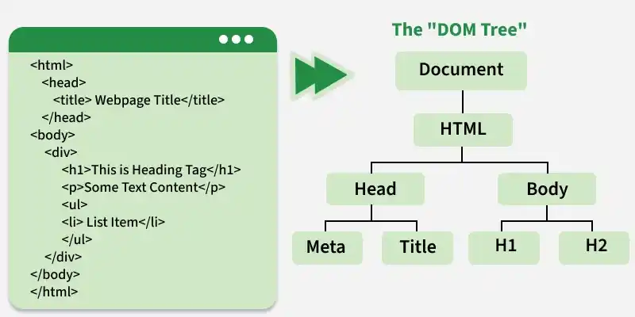
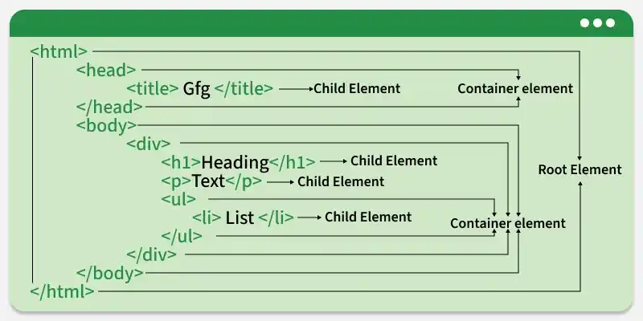
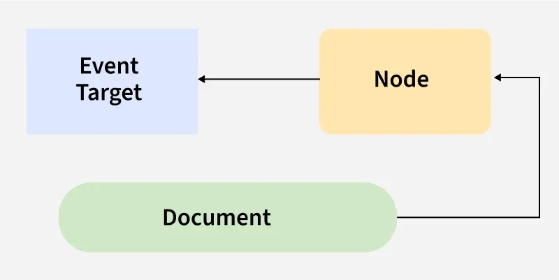
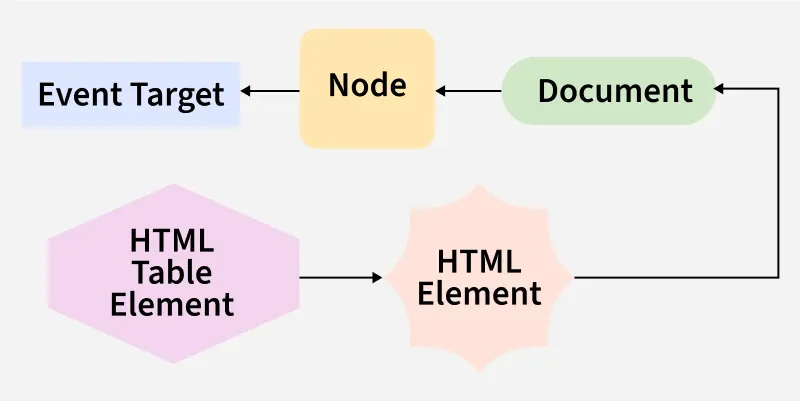
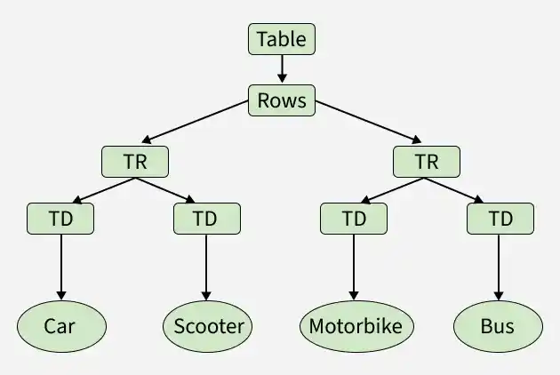

# HTML DOM (Document Object Model)

The **HTML Document Object Model (DOM)** is a structured representation of a web page that allows developers to access, modify, and control its content and structure using JavaScript. It powers most dynamic website interactions, enabling features like real-time updates, form validation, and interactive user interfaces.

The HTML DOM is organized as a tree structure, where each HTML tag becomes a node in the hierarchy. At the top, the `<html>` tag is the root element, containing `<head>` and `<body>` as child elements. This hierarchy allows developers to navigate and manipulate web page content by traversing from parent to child and vice versa.




---

### Requirement of DOM

The DOM is essential for several reasons:

* **Dynamic Content Updates:** Allows content updates (e.g., AJAX responses) without reloading the page.
* **User Interaction:** Makes the webpage interactive by responding to clicks and submissions.
* **Flexibility:** Developers can add, modify, or remove elements and styles in real-time.
* **Cross-Platform Compatibility:** Provides a standard way for scripts to interact with documents across different browsers.

### Working of DOM

The DOM connects your webpage to JavaScript, allowing you to access elements, modify content, react to events, and create or remove elements dynamically.

### Types of DOM

* **Core DOM:** A standard model for all document types.
* **XML DOM:** A standard model for XML documents.
* **HTML DOM:** A standard model specifically for HTML documents to get, change, add, or delete elements.

### Properties of the DOM

* **Node-Based:** Everything is a node (element, text, or attribute).
* **Hierarchical:** Maintains a parent-child relationship tree.
* **Live:** Changes are immediately reflected on the page.
* **Platform-Independent:** Works across different platforms and languages.

### The Document, The Window (BOM), and Objects

* **The Document:** The entry point to the content. It allows access to page information like the URL and manipulation of the DOM tree.
* **The Window (BOM):** The **Browser Object Model (BOM)** allows JavaScript to interact with the browser. The `window` object represents the browser window, and the `document` object is a property of the `window`.
* **The Object:** DOM elements are organized as objects (e.g., a table implements the `HTMLTableElement` interface).



### The Interface

An interface is a blueprint for elements. The hierarchy is as follows:

* `EventTarget` (Base) → `Node` → `Document` / `HTMLElement` → `HTMLTableElement`.



### Accessing Data from the DOM

JavaScript uses the following APIs to access elements:

* **ID:** `document.getElementById("intro")`
* **Class:** `document.getElementsByClassName("intro")`
* **CSS selectors:** `document.querySelectorAll("p.intro")`
* **HTML Collections:** `document.anchors`, `document.forms`, `document.images`, etc.

### DOM Data Types

* **Document:** The entire webpage.
* **Node:** Any part of the page (element, text, comment).
* **Element:** A specific type of node (e.g., `<div>`, `<p>`).
* **NodeList:** A collection of nodes.

### Commonly Used DOM Methods

| Method | Description |
| --- | --- |
| `getElementById(id)` | Selects an element by unique ID. |
| `getElementsByClassName(class)` | Retrieves elements by class name. |
| `querySelector(selector)` | Returns the first matching element. |
| `querySelectorAll(selector)` | Returns all matching elements. |
| `createElement(tag)` | Creates a new HTML element dynamically. |
| `appendChild(node)` | Adds a child node to an existing element. |
| `remove()` | Removes an element from the DOM. |
| `addEventListener(event, fn)` | Attaches an event handler. |

---

### Code Examples

**1. Finding HTML Elements by ID**

```html
<html>
<body>
    <h2>GeeksforGeeks</h2>
    <p id="intro">A Computer Science portal for geeks.</p>
    <p>This example illustrates the <b>getElementById</b> method.</p>
    <p id="demo"></p>
    <script>
        const element = document.getElementById("intro");
        document.getElementById("demo").innerHTML =
            "GeeksforGeeks introduction is: " + element.innerHTML;
    </script>
</body>
</html>

```

**2. Understanding HTML Table Structure**

This image visually represents how <table> contains <tr> (rows), which contain <td> (cells), and how each cell can hold content like "Car", "Scooter", etc., making it a clear example of HTML DOM structure for tables.



**3. Dynamic DOM Calculation (index.html)**

```html
<html>
<head></head>
<body>
    <label>Enter Value 1: </label>
    <input type="text" id="val1" />
    <br /><br />
    <label>Enter Value 2: </label>
    <input type="text" id="val2" />
    <br />
    <button onclick="getAdd()">Click To Add</button>
    <p id="result"></p>
    <script type="text/javascript">
        function getAdd() {
            const num1 = Number(document.getElementById("val1").value);
            const num2 = Number(document.getElementById("val2").value);
            const add = num1 + num2;
            console.log(add);
            document.getElementById("result").innerHTML = "Addition : " + add;
            document.getElementById("result").style.color = "red";
        }
    </script>
</body>
</html>

```

---

### Misunderstandings About the DOM

* It is **not** a binary description or source code.
* It is **not** used to describe objects *in* XML or HTML, but rather describes them *as* objects.
* It is **not** a set of data structures, but an interface specifying object representation.
* It does **not** determine the contextual criticality of objects within a document.

---