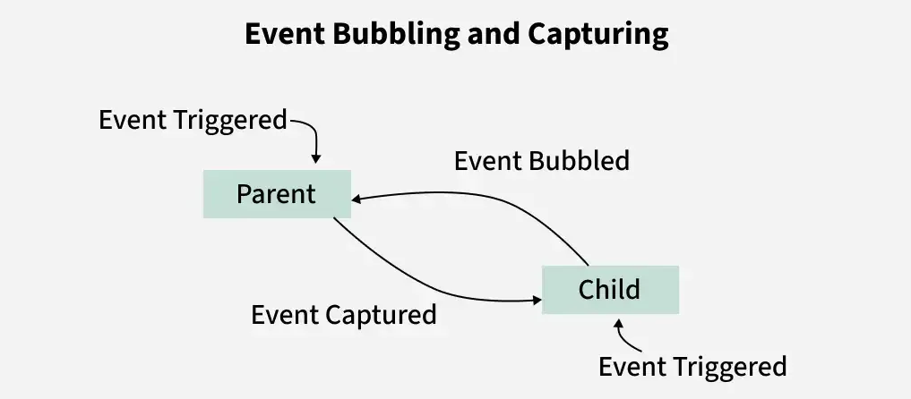

# Event Bubbling in JavaScript

**Event Bubbling** is a mechanism in JavaScript's event propagation model where an event that occurs on a child element automatically moves upward through its parent elements in the Document Object Model (DOM).

In simple terms, when an event is triggered on an element, JavaScript first executes the event handler on that element and then "bubbles" the event up through its ancestors until it reaches the root of the document.

Event bubbling is one of the most important concepts in JavaScript because it enables techniques such as **event delegation**, improves performance, and simplifies event management in large applications.

---

# Understanding Event Propagation



Whenever an event occurs, JavaScript processes it through three phases:

```text
1. Capturing Phase
2. Target Phase
3. Bubbling Phase
```

Suppose we have the following DOM structure:

```html
<div class="grandparent">
    <div class="parent">
        <button class="child">
            Click Me
        </button>
    </div>
</div>
```

The DOM hierarchy looks like:

```text
Document
   │
Grandparent
   │
 Parent
   │
 Child (Button)
```

When the button is clicked, JavaScript processes the event as follows:

### Capturing Phase

The event travels from the root down toward the target.

```text
Document
   ↓
Grandparent
   ↓
Parent
   ↓
Child
```

### Target Phase

The event reaches the actual element that triggered the event.

```text
Child Button
```

### Bubbling Phase

The event moves upward through the ancestors.

```text
Child
   ↑
Parent
   ↑
Grandparent
   ↑
Document
```

Event bubbling occurs during this third phase.

---

# Characteristics of Event Bubbling

### 1. Upward Propagation

The event starts at the target element and moves upward through its parent elements.

### 2. Default Behavior

Event bubbling is enabled by default in JavaScript.

```javascript
button.addEventListener("click", handler);
```

The above listener automatically participates in the bubbling phase.

### 3. Multiple Event Listeners Execute Sequentially

If several ancestors have listeners for the same event, they execute in order from the innermost element to the outermost element.

### 4. Supported by Most Events

Common bubbling events include:

* click
* dblclick
* keydown
* keyup
* input
* change
* mouseover

---

# Working of Event Bubbling

Consider the following nested structure:

```html
<div class="grandparent">
    <div class="parent">
        <div class="child">
            Child
        </div>
    </div>
</div>
```

Each element contains a click listener.

```javascript
grandparent.addEventListener("click", () => {
    console.log("Grandparent Clicked");
});

parent.addEventListener("click", () => {
    console.log("Parent Clicked");
});

child.addEventListener("click", () => {
    console.log("Child Clicked");
});
```

---

# Complete Example

```html
<html>
<head>
<style>
*{
    margin:25px;
    box-sizing:border-box;
}

.grandparent{
    height:350px;
    width:350px;
    border:2px solid red;
}

.parent{
    height:250px;
    width:250px;
    border:2px solid blue;
}

.child{
    height:150px;
    width:150px;
    border:2px solid green;
}
</style>
</head>

<body>

<div class="grandparent" id="one">
    Grandparent

    <div class="parent" id="two">
        Parent

        <div class="child" id="three">
            Child
        </div>

    </div>
</div>

<script>

let grandparent =
document.getElementById("one");

let parent =
document.getElementById("two");

let child =
document.getElementById("three");

grandparent.addEventListener(
"click",
function(e){
    console.log("Grandparent Clicked");
});

parent.addEventListener(
"click",
function(e){
    console.log("Parent Clicked");
});

child.addEventListener(
"click",
function(e){
    console.log("Child Clicked");
});

</script>

</body>
</html>
```

---

# Output

When the child element is clicked:

```text
Child Clicked
Parent Clicked
Grandparent Clicked
```

---

# Step-by-Step Execution

### Step 1

User clicks the child element.

```text
Target = Child
```

### Step 2

The child's event listener executes.

```text
Child Clicked
```

### Step 3

The event bubbles upward to the parent.

```text
Parent Clicked
```

### Step 4

The event continues upward to the grandparent.

```text
Grandparent Clicked
```

### Step 5

The event eventually reaches the document root.

This demonstrates the bubbling behavior where the event travels upward through the DOM hierarchy.

---

# Understanding the Event Object

Whenever an event occurs, JavaScript automatically creates an **event object**.

```javascript
child.addEventListener("click", function(e){
    console.log(e);
});
```

The event object contains useful information such as:

| Property              | Description                          |
| --------------------- | ------------------------------------ |
| `e.target`            | Element that triggered the event     |
| `e.currentTarget`     | Element currently handling the event |
| `e.type`              | Type of event                        |
| `e.stopPropagation()` | Stops bubbling                       |
| `e.preventDefault()`  | Prevents default browser action      |

---

# e.target vs e.currentTarget

These properties are often confused.

Example:

```javascript
parent.addEventListener("click", function(e){

    console.log(e.target);

    console.log(e.currentTarget);

});
```

Suppose the child is clicked.

Output:

```text
e.target = Child
e.currentTarget = Parent
```

### Difference

| Property        | Meaning                                  |
| --------------- | ---------------------------------------- |
| `target`        | Element where event originated           |
| `currentTarget` | Element currently executing the listener |

This distinction becomes very important in event delegation.

---

# Stopping Event Bubbling

Sometimes you may not want an event to continue bubbling upward.

JavaScript provides:

```javascript
e.stopPropagation();
```

This method immediately stops the event from moving to parent elements.

---

# Example: Stop Event Bubbling

```javascript
child.addEventListener(
"click",
function(e){

    e.stopPropagation();

    console.log("Child Clicked");
});
```

Output:

```text
Child Clicked
```

Only the child listener executes.

The parent and grandparent listeners never run.

---

# Complete Example with stopPropagation()

```javascript
grandparent.addEventListener(
"click",
function(e){

    e.stopPropagation();

    console.log("Grandparent Clicked");

});

parent.addEventListener(
"click",
function(e){

    e.stopPropagation();

    console.log("Parent Clicked");

});

child.addEventListener(
"click",
function(e){

    e.stopPropagation();

    console.log("Child Clicked");

});
```

---

# Result

If the child is clicked:

```text
Child Clicked
```

If the parent is clicked:

```text
Parent Clicked
```

If the grandparent is clicked:

```text
Grandparent Clicked
```

Each element behaves independently because bubbling is prevented.

---

# Why Use stopPropagation()?

Common use cases include:

### Modal Windows

Prevent clicks inside a modal from closing the modal.

```javascript
modal.addEventListener("click",
e => e.stopPropagation());
```

### Dropdown Menus

Prevent clicks inside the dropdown from triggering document click handlers.

### Nested Buttons

Prevent parent click actions from executing when child buttons are clicked.

---

# Event Delegation and Event Bubbling

One of the most powerful applications of event bubbling is **event delegation**.

Instead of attaching listeners to many child elements:

```javascript
item1.addEventListener(...);
item2.addEventListener(...);
item3.addEventListener(...);
```

Attach a single listener to the parent:

```javascript
document.getElementById("parent")
.addEventListener("click", (event) => {

    console.log(
        "Clicked:",
        event.target.id
    );

});
```

---

# Why Event Delegation Works

Suppose we have:

```html
<ul id="list">
    <li>Item 1</li>
    <li>Item 2</li>
    <li>Item 3</li>
</ul>
```

When a list item is clicked:

```text
LI
 ↑
UL
```

The click bubbles up to the `<ul>`.

The parent listener can determine which child was clicked using:

```javascript
event.target
```

---

# Advantages of Event Delegation

### Better Performance

Only one event listener is required.

### Less Memory Usage

Fewer listeners consume fewer resources.

### Easier Maintenance

No need to attach listeners individually.

### Supports Dynamic Elements

New elements automatically work without adding new listeners.

---

# Event Bubbling vs Event Capturing

| Event Bubbling                 | Event Capturing                           |
| ------------------------------ | ----------------------------------------- |
| Event starts at target element | Event starts at document root             |
| Event moves upward             | Event moves downward                      |
| Default behavior               | Must be enabled explicitly                |
| Child handlers execute first   | Parent handlers execute first             |
| Commonly used                  | Less commonly used                        |
| Useful for event delegation    | Useful when parent should intercept first |

---

# Example of Event Capturing

```javascript
parent.addEventListener(
"click",
function(){
    console.log("Parent");
},
true
);
```

Notice the third parameter:

```javascript
true
```

This enables the capturing phase.

Execution order becomes:

```text
Parent
Child
```

instead of:

```text
Child
Parent
```

---

# Real-World Applications of Event Bubbling

## 1. Navigation Menus

Handle clicks for many menu items using one listener.

## 2. Dynamic Lists

Detect clicks on dynamically added items.

## 3. Data Tables

Handle row selections efficiently.

## 4. Shopping Carts

Manage hundreds of buttons with minimal listeners.

## 5. Chat Applications

Process interactions on dynamically generated messages.

---

# Key Points

* Event bubbling is a phase of event propagation where events move upward through the DOM.
* Bubbling starts at the target element and continues through its ancestors.
* It is the default behavior of JavaScript events.
* Child listeners execute before parent listeners.
* The event object provides useful properties such as `target` and `currentTarget`.
* `stopPropagation()` prevents bubbling.
* Event delegation relies on event bubbling to efficiently manage events.
* Event bubbling is widely used in modern JavaScript applications because it improves performance and simplifies code.

## Summary

**Event Bubbling** is a fundamental JavaScript mechanism that allows events triggered on child elements to propagate upward through parent elements in the DOM. By understanding how bubbling works, developers can build efficient event-handling systems, implement event delegation, reduce memory usage, and create more maintainable web applications. Combined with methods such as `stopPropagation()` and concepts like event capturing, event bubbling forms the foundation of JavaScript's event propagation model.

---