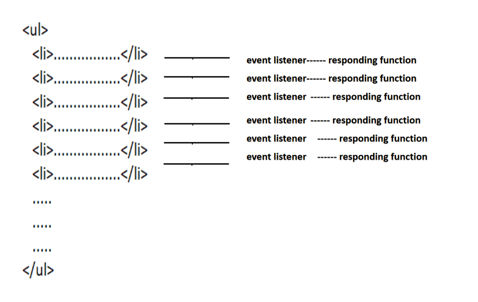

# Event Delegation in JavaScript

**Event Delegation** is a JavaScript design pattern used to handle events efficiently by attaching a single event listener to a parent element rather than attaching separate event listeners to each child element.

Instead of listening for events on every child element individually, the parent element listens for events that bubble up from its children. Using the `event.target` property, JavaScript can determine which child element originally triggered the event.

Event delegation is one of the most important concepts in modern JavaScript because it improves performance, reduces memory consumption, and simplifies event management, especially when working with dynamic content.



---

# Why Do We Need Event Delegation?

Consider a webpage containing many similar elements:

```html
<ul>
    <li>Item 1</li>
    <li>Item 2</li>
    <li>Item 3</li>
    <li>Item 4</li>
    <li>Item 5</li>
</ul>
```

Suppose we want each list item to respond when clicked.

A beginner approach would be:

```javascript
const items = document.querySelectorAll("li");

items.forEach(item => {
    item.addEventListener("click", () => {
        console.log("Item Clicked");
    });
});
```

This works, but every `<li>` receives its own event listener.

If there are:

* 10 items → 10 listeners
* 100 items → 100 listeners
* 1,000 items → 1,000 listeners

This can become inefficient.

Event delegation solves this problem by using a single listener on the parent element.

---

# Key Characteristics of Event Delegation

### 1. Uses a Single Event Listener

Instead of many listeners:

```javascript
li1.addEventListener(...);
li2.addEventListener(...);
li3.addEventListener(...);
```

Use:

```javascript
ul.addEventListener(...);
```

---

### 2. Relies on Event Bubbling

When a child element is clicked:

```text
LI
 ↑
UL
 ↑
BODY
 ↑
DOCUMENT
```

The event bubbles upward until it reaches the parent.

---

### 3. Uses event.target

The parent listener determines which child was clicked using:

```javascript
event.target
```

---

### 4. Supports Dynamic Elements

New elements added after page load automatically work without adding new event listeners.

---

# Problem Without Event Delegation

Consider the following code:

```javascript
const customUI =
document.createElement('ul');

for(let i = 1; i <= 10; i++){

    const newElement =
    document.createElement('li');

    newElement.textContent =
    "This is line " + i;

    newElement.addEventListener(
        'click',
        () => {
            console.log('Responding');
        }
    );

    customUI.appendChild(newElement);
}
```

---

# What Happens Here?

### Step 1

A `<ul>` element is created.

```javascript
const customUI =
document.createElement('ul');
```

---

### Step 2

Ten `<li>` elements are created.

```javascript
for(let i = 1; i <= 10; i++)
```

---

### Step 3

Each `<li>` receives its own click listener.

```javascript
newElement.addEventListener(
    'click',
    () => {
        console.log('Responding');
    }
);
```

---

# Drawbacks

### Multiple Event Listeners

Each list item receives a separate listener.

```text
LI 1 → Listener
LI 2 → Listener
LI 3 → Listener
LI 4 → Listener
...
LI 10 → Listener
```

---

### Increased Memory Usage

Every listener consumes memory.

As the number of elements grows, memory usage increases.

---

### Reduced Performance

The browser must manage many listeners.

This becomes expensive in large applications.

---

### Harder Maintenance

When adding new items dynamically, new listeners must also be added.

---

# Improved Version Using a Shared Function

Instead of creating identical callback functions repeatedly:

```javascript
const customUI =
document.createElement('ul');

function responding(){
    console.log('Responding');
}

for(let i = 1; i <= 10; i++){

    const newElement =
    document.createElement('li');

    newElement.textContent =
    "This is line " + i;

    newElement.addEventListener(
        'click',
        responding
    );

    customUI.appendChild(newElement);
}
```

---

# Benefits

### Shared Function

Only one function is created.

```javascript
function responding(){
    console.log("Responding");
}
```

---

### Better Readability

The code is easier to maintain.

---

### Less Function Duplication

JavaScript does not create ten identical callback functions.

---

# Remaining Problem

Even though only one function exists, there are still:

```text
10 Event Listeners
```

attached to the DOM.

We can do better.

---

# Using Event Delegation

Instead of attaching listeners to every `<li>`, attach one listener to the parent `<ul>`.

```javascript
const customUI =
document.createElement('ul');

function responding(){
    console.log('Responding');
}

for(let i = 1; i <= 10; i++){

    const newElement =
    document.createElement('li');

    newElement.textContent =
    "This is line " + i;

    customUI.appendChild(newElement);
}

customUI.addEventListener(
    'click',
    responding
);
```

---

# What's Different?

Only one event listener exists.

```text
UL → Listener
```

Instead of:

```text
LI → Listener
LI → Listener
LI → Listener
LI → Listener
...
```

---

# How Event Delegation Works

Suppose the user clicks:

```html
<li>This is line 5</li>
```

The event path becomes:

```text
Document
  ↓
Body
  ↓
UL
  ↓
LI
```

Target reached:

```text
LI
```

Then bubbling begins:

```text
LI
 ↑
UL
 ↑
Body
 ↑
Document
```

The event eventually reaches the `<ul>`.

The listener attached to the `<ul>` executes.

---

# Steps of Event Delegation

## Step 1

The user clicks a child element.

```text
LI Clicked
```

---

## Step 2

The event enters the capturing phase.

```text
Document
 ↓
Body
 ↓
UL
 ↓
LI
```

---

## Step 3

The event reaches the target element.

```text
LI
```

---

## Step 4

The event enters the bubbling phase.

```text
LI
 ↑
UL
 ↑
Body
 ↑
Document
```

---

## Step 5

The event reaches the parent element.

```text
UL
```

---

## Step 6

The parent's event listener executes.

```javascript
ul.addEventListener("click", handler);
```

---

## Step 7

The listener determines which child was clicked using:

```javascript
event.target
```

---

# Understanding event.target

The `event.target` property returns the element that originally triggered the event.

Example:

```html
<ul id="list">
    <li>Item 1</li>
    <li>Item 2</li>
    <li>Item 3</li>
</ul>
```

```javascript
document.getElementById("list")
.addEventListener("click", (event) => {

    console.log(event.target);

});
```

If the user clicks Item 2:

```text
<li>Item 2</li>
```

will be logged.

---

# Using nodeName

Sometimes a parent contains multiple types of child elements.

Example:

```html
<ul>
    <li>Item 1</li>
    <li>Item 2</li>
    <button>Button</button>
</ul>
```

We may only want to respond to list items.

```javascript
if(event.target.nodeName === "LI"){
    console.log("List item clicked");
}
```

---

# Complete Event Delegation Example

```javascript
const customUI =
document.createElement('ul');

function responding(evt){

    if(evt.target.nodeName === 'LI'){

        console.log('Responding');

    }

}

for(let i = 1; i <= 10; i++){

    const newElement =
    document.createElement('li');

    newElement.textContent =
    "This is line " + i;

    customUI.appendChild(newElement);

}

customUI.addEventListener(
    'click',
    responding
);
```

---

# What Happens?

When the user clicks:

```text
This is line 7
```

The event bubbles to the parent `<ul>`.

The listener executes.

```javascript
evt.target.nodeName === 'LI'
```

returns:

```javascript
true
```

Output:

```text
Responding
```

---

# Event Delegation vs Traditional Event Handling

| Traditional Event Handling     | Event Delegation                         |
| ------------------------------ | ---------------------------------------- |
| Many listeners                 | One listener                             |
| More memory usage              | Less memory usage                        |
| Harder maintenance             | Easier maintenance                       |
| Slower with many elements      | Better performance                       |
| Difficult for dynamic elements | Automatically works for dynamic elements |
| Repetitive code                | Cleaner code                             |

---

# Dynamic Elements and Event Delegation

One of the biggest advantages of event delegation is support for dynamically added elements.

Consider:

```javascript
const li =
document.createElement("li");

li.textContent =
"New Item";

ul.appendChild(li);
```

Without event delegation:

```javascript
li.addEventListener(...)
```

must be added manually.

With event delegation:

```javascript
ul.addEventListener(...)
```

already handles the new item automatically.

No extra code is required.

---

# Real-World Applications of Event Delegation

Below are practical examples showing how **Event Delegation** is used in real-world applications. In each example, notice that **only one event listener is attached to the parent element**, while the child elements are identified using `event.target`.

---

# 1. Navigation Menu

Instead of attaching a click listener to every menu item, attach one listener to the `<ul>`.

### HTML

```html
<ul class="menu">
    <li>Home</li>
    <li>About</li>
    <li>Services</li>
    <li>Contact</li>
</ul>
```

### JavaScript

```javascript
const menu = document.querySelector(".menu");

menu.addEventListener("click", (event) => {

    if (event.target.tagName === "LI") {

        console.log(
            `Navigating to ${event.target.textContent}`
        );

    }

});
```

### How It Works

If the user clicks:

```html
<li>Services</li>
```

Output:

```text
Navigating to Services
```

Only the `<ul>` has a listener.

---

# 2. Data Tables

Large tables may contain hundreds or thousands of rows. Event delegation avoids adding listeners to every row.

### HTML

```html
<table id="employeeTable" border="1">
    <tr>
        <td>101</td>
        <td>John</td>
    </tr>

    <tr>
        <td>102</td>
        <td>Mary</td>
    </tr>

    <tr>
        <td>103</td>
        <td>David</td>
    </tr>
</table>
```

### JavaScript

```javascript
const table =
document.getElementById("employeeTable");

table.addEventListener("click", (event) => {

    const row =
    event.target.closest("tr");

    if (row) {

        console.log(
            `Selected Employee ID: ${
                row.cells[0].textContent
            }`
        );

    }

});
```

### Output

Clicking Mary's row:

```text
Selected Employee ID: 102
```

### Why Use Delegation?

Instead of:

```javascript
row1.addEventListener(...)
row2.addEventListener(...)
row3.addEventListener(...)
```

one listener handles every row.

---

# 3. Chat Application

Messages may be added dynamically after the page loads.

### HTML

```html
<div id="chat">

    <div class="message">
        Hello there!
    </div>

    <div class="message">
        How are you?
    </div>

</div>

<button id="addMessage">
    Add Message
</button>
```

### JavaScript

```javascript
const chat =
document.getElementById("chat");

chat.addEventListener("click", (event) => {

    if (
        event.target.classList.contains(
            "message"
        )
    ) {

        console.log(
            `Message clicked: ${
                event.target.textContent
            }`
        );

    }

});

document
.getElementById("addMessage")
.addEventListener("click", () => {

    const message =
    document.createElement("div");

    message.className = "message";

    message.textContent =
    "New message added!";

    chat.appendChild(message);

});
```

### Output

Clicking a newly added message:

```text
Message clicked: New message added!
```

### Benefit

New messages automatically work without adding new listeners.

---

# 4. Todo List

One listener can manage all current and future tasks.

### HTML

```html
<input
    type="text"
    id="taskInput"
    placeholder="Enter task">

<button id="addTask">
    Add Task
</button>

<ul id="todoList"></ul>
```

### JavaScript

```javascript
const todoList =
document.getElementById("todoList");

document
.getElementById("addTask")
.addEventListener("click", () => {

    const input =
    document.getElementById("taskInput");

    const li =
    document.createElement("li");

    li.textContent = input.value;

    todoList.appendChild(li);

    input.value = "";

});

todoList.addEventListener(
    "click",
    (event) => {

        if (
            event.target.tagName === "LI"
        ) {

            event.target.classList
                  .toggle("completed");

        }

    }
);
```

### CSS

```css
.completed {
    text-decoration: line-through;
}
```

### Output

Clicking a task:

```text
Buy Milk
```

becomes:

```text
✓ Buy Milk
```

(strikethrough effect)

### Benefit

Every new task automatically receives click functionality.

---

# 5. E-Commerce Product Cards

Online stores may display hundreds of products. Event delegation allows one listener to handle all product actions.

### HTML

```html
<div id="products">

    <div class="product">
        <h3>Laptop</h3>
        <button class="buy">
            Add to Cart
        </button>
    </div>

    <div class="product">
        <h3>Phone</h3>
        <button class="buy">
            Add to Cart
        </button>
    </div>

    <div class="product">
        <h3>Tablet</h3>
        <button class="buy">
            Add to Cart
        </button>
    </div>

</div>
```

### JavaScript

```javascript
const products =
document.getElementById("products");

products.addEventListener(
    "click",
    (event) => {

        if (
            event.target.classList
                 .contains("buy")
        ) {

            const product =
            event.target
                 .closest(".product");

            const name =
            product.querySelector("h3")
                   .textContent;

            console.log(
                `${name} added to cart`
            );

        }

    }
);
```

### Output

Clicking the Phone button:

```text
Phone added to cart
```

### Benefit

Whether there are:

```text
3 products
30 products
300 products
3000 products
```

only one event listener is required.

---

# Summary

| Application     | Parent Element    | Child Element   | Event |
| --------------- | ----------------- | --------------- | ----- |
| Navigation Menu | `<ul>`            | `<li>`          | Click |
| Data Table      | `<table>`         | `<tr>` / `<td>` | Click |
| Chat App        | Chat Container    | Message         | Click |
| Todo List       | `<ul>`            | `<li>`          | Click |
| E-Commerce      | Product Container | Buttons         | Click |

In all these examples, **event bubbling** allows the event to travel from the child element to the parent element, where a **single event listener** handles all interactions efficiently. This reduces memory usage, improves performance, and automatically supports dynamically added elements.

---

# Common Mistakes

### Forgetting event.target

```javascript
ul.addEventListener("click", () => {
    console.log("Clicked");
});
```

This doesn't identify which child was clicked.

---

### Not Filtering Elements

```javascript
ul.addEventListener("click", (e) => {
    console.log(e.target);
});
```

Any child element can trigger the event.

Use:

```javascript
if(e.target.nodeName === "LI")
```

to filter correctly.

---

### Using Event Delegation for Non-Bubbling Events

Some events do not bubble.

Examples:

```text
focus
blur
```

Event delegation does not work directly with these events unless alternative techniques are used.

---

# Advantages of Event Delegation

* Reduces the number of event listeners.
* Improves performance.
* Uses less memory.
* Simplifies code.
* Easier to maintain.
* Supports dynamically created elements.
* Makes large applications more scalable.

---

# Key Points

* Event Delegation is a technique that uses one parent event listener to manage events from multiple child elements.
* It works because of event bubbling.
* The `event.target` property identifies the element that triggered the event.
* `nodeName` can be used to determine the type of clicked element.
* Event delegation improves performance and memory efficiency.
* It is especially useful when dealing with dynamically generated content.

## Summary

**Event Delegation** is a powerful JavaScript pattern that allows developers to handle events efficiently by attaching a single event listener to a parent element instead of multiple listeners to child elements. By leveraging event bubbling and the `event.target` property, event delegation reduces memory consumption, improves performance, simplifies code maintenance, and automatically supports dynamically added elements. For these reasons, it is widely used in modern JavaScript applications and frameworks.

---