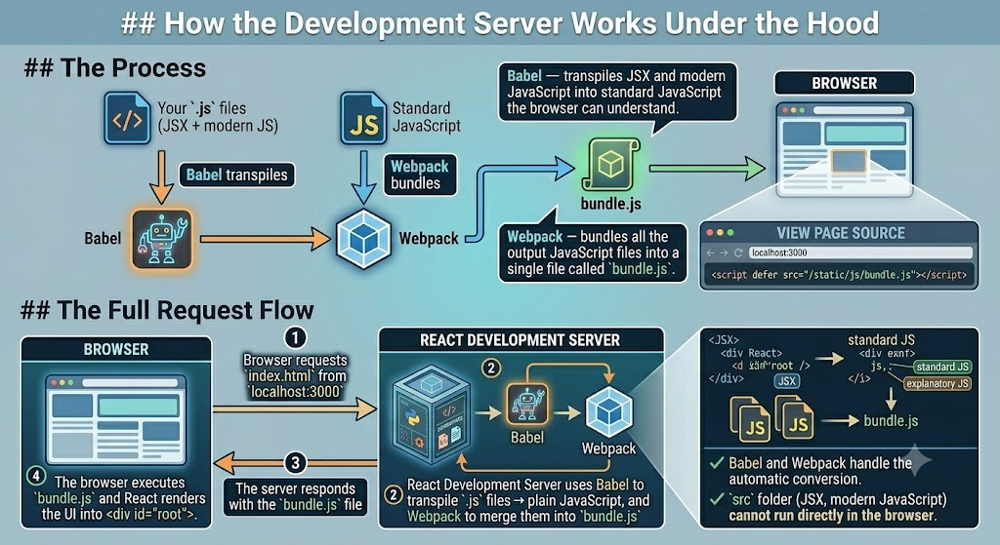
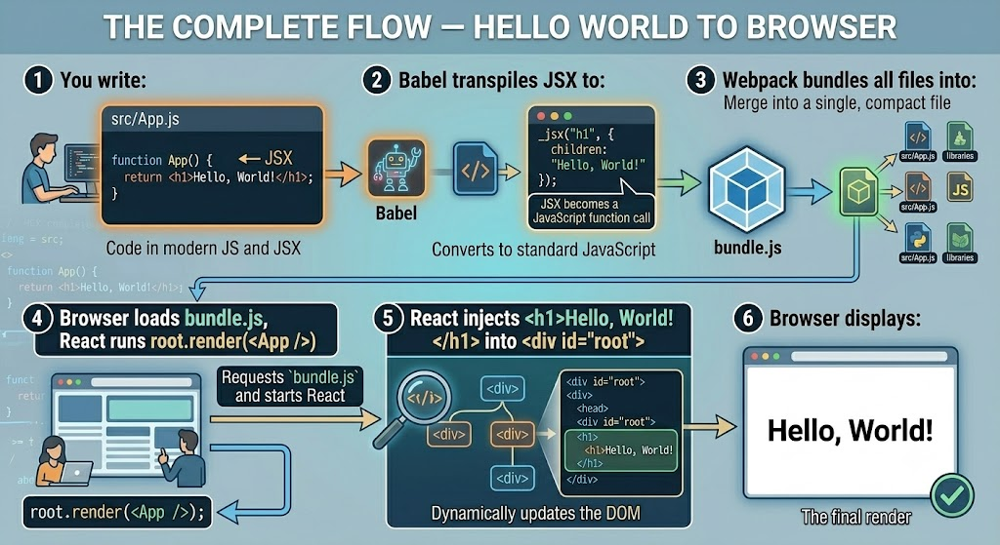

# React Hello World

---

## Prerequisites

Before creating a React app, make sure Node.js and npm are installed. Open your terminal and verify:

```bash
node --version
# v21.3.0

npm --version
# 10.2.4
```

If either command returns an error, download and install Node.js from [nodejs.org](https://nodejs.org) — npm is included automatically.

---

## Creating the Project

### Step 1 — Create the React app

```bash
npx create-react-app hello-world
```

This creates a new directory called `hello-world` and sets up all the project files and dependencies. It takes a few minutes on the first run.

### Step 2 — Navigate into the project folder

```bash
cd hello-world
```

### Step 3 — Start the development server

```bash
npm start
```

This starts the development server and automatically opens `http://localhost:3000` in your browser. You'll see the default React welcome page.

### Step 4 — Stop the development server

Press `Ctrl + C` in the terminal. You'll be prompted to confirm:

```
^CTerminate batch job (Y/N)? Y
```

Enter `Y` and press Enter to stop the server.

---

## Project Files and Directories

When you open the project in VS Code, you'll see this structure:

```
hello-world/
├── public/
│   └── index.html          ← the HTML skeleton — only one HTML file
├── src/
│   ├── index.js            ← first file that runs when the app starts
│   ├── BookApp.js              ← main component
│   ├── App.css
│   ├── reportWebVitals.js
│   └── setupTests.js
├── package.json            ← lists all dependencies
└── node_modules/           ← installed packages (never edit manually)
```

The files you work with most are in the `src` directory. Here is what the key files do:

| File | Description |
|---|---|
| `src/index.js` | The entry point — first file that executes when the React app starts |
| `public/index.html` | The HTML skeleton — contains the `<div id="root">` where React mounts |
| `package.json` | Lists all the packages and dependencies the app needs |
| `node_modules/` | Stores all installed dependencies — never edit this manually |

---

## How the Development Server Works Under the Hood

The code you write in the `src` folder (JSX, modern JavaScript) **cannot run directly in the browser**. Browsers only understand plain HTML, CSS, and standard JavaScript.

The React Development Server handles the conversion automatically using two tools:

**Babel** — transpiles JSX and modern JavaScript into standard JavaScript the browser can understand.

**Webpack** — bundles all the output JavaScript files into a single file called `bundle.js`.

The process:

```
Your .js files (JSX + modern JS)
         ↓
    Babel transpiles
         ↓
    Standard JavaScript
         ↓
    Webpack bundles
         ↓
       bundle.js
         ↓
    Delivered to browser
```

If you view the page source at `localhost:3000`, you'll see the bundled file being loaded:

```html
<script defer src="/static/js/bundle.js"></script>
```

### The full request flow:

1. Browser requests `index.html` from `localhost:3000`
2. React Development Server uses Babel to transpile `.js` files → plain JavaScript, and Webpack to merge them into `bundle.js`
3. The server responds with the `bundle.js` file
4. The browser executes `bundle.js` and React renders the UI into `<div id="root">`



---

## Building the Hello World App

To build a clean Hello World app, delete everything in `public` except `index.html`, and delete all files in `src`. Then create a fresh `src/index.js` with just this code:

```js
import React from 'react';
import ReactDOM from 'react-dom/client';

const el = document.querySelector('#root');
const root = ReactDOM.createRoot(el);

function App() {
  return <h1>Hello, World!</h1>;
}

root.render(<App />);
```

### Line-by-Line Breakdown

**Importing the React libraries:**

```js
import React from 'react';
import ReactDOM from 'react-dom/client';
```

| Import | Purpose |
|---|---|
| `react` | Allows you to define components and how they work together |
| `react-dom/client` | Knows how to display a component in the web browser (DOM-specific) |

**Selecting the root element:**

```js
const el = document.querySelector('#root');
```

This finds the `<div id="root"></div>` in `public/index.html` — the container where React will inject everything.

**Creating the React root:**

```js
const root = ReactDOM.createRoot(el);
```

This tells React to take control of that `div` and manage everything inside it.

**Defining the component:**

```js
function App() {
  return <h1>Hello, World!</h1>;
}
```

`App` is a **React component** — a JavaScript function that returns JSX. The JSX `<h1>Hello, World!</h1>` looks like HTML but is actually a JavaScript syntax extension.

**Rendering the component:**

```js
root.render(<App />);
```

This takes the `App` component and displays it inside the root element on the screen. `<App />` is how you call a component in JSX — like a self-closing HTML tag.

---

## What is JSX?

**JSX** stands for **JavaScript XML**. It is a syntax extension for JavaScript that lets you write HTML-like code directly inside JavaScript files.

```jsx
// JSX — looks like HTML, but it's inside a JavaScript function
function App() {
  return <h1>Hello, World!</h1>;
}
```

JSX is **not** valid JavaScript on its own — browsers cannot read it. That is why Babel transpiles it first.

### What Babel does to JSX

When you write this JSX:

```jsx
<h1>Hello, World!</h1>
```

Babel converts it into this plain JavaScript:

```js
import { jsx as _jsx } from "react/jsx-runtime";

_jsx("h1", {
  children: "Hello, World!"
});
```

The `_jsx` function call is what actually creates the HTML element. JSX is just a more readable shorthand that Babel converts behind the scenes.

> You can test this yourself at [babeljs.io](https://babeljs.io) — paste in JSX and see the output JavaScript.

---



---

## Summary

- A **React component** is a JavaScript function that returns JSX.
- **JSX** is a JavaScript syntax extension that lets you write HTML-like code inside JavaScript — it is not actual HTML.
- Browsers cannot run JSX directly. The React Development Server uses **Babel** to transpile JSX to plain JavaScript and **Webpack** to bundle all files into `bundle.js`.
- `ReactDOM.createRoot(el)` tells React which DOM element to control.
- `root.render(<App />)` displays the component on the screen.
- The `<div id="root">` in `index.html` is the single mount point — React injects the entire application inside it.

---