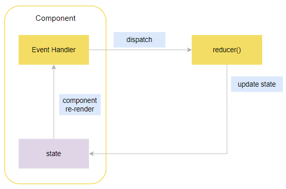
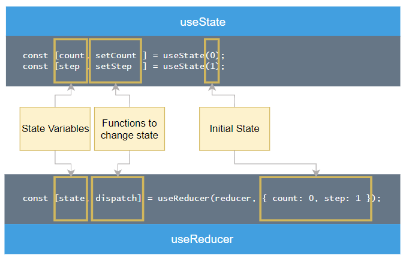

# `useReducer` hook

The `useReducer` hook is a powerful alternative to `useState`, designed specifically for managing complex state logic in React components.

### Introduction to the React `useReducer()` Hook

The `useReducer` hook is useful when:

* The component has multiple closely related pieces of state.
* The future state value depends on the current state.

#### Steps to Use `useReducer`

1. **Import** the hook: `import { useReducer } from 'react';`
2. **Define a reducer function** that takes `state` and `action` as parameters.
3. **Initialize the hook** in your component:
```javascript
const [state, dispatch] = useReducer(reducer, initialArg, init?);

```


* **`state`**: The current state.
* **`dispatch`**: A function used to update the state and trigger a re-render.
* **`initialArg`**: The initial state.
* **`init` (optional)**: A function to return the initial state.

The following shows how the useReducer hook works.



---

### Comparison: `useState` vs `useReducer`

The following diagram illustrates the equivalence of useState and useReducer hooks:



#### Original Code (using `useState`)

```javascript
import { useState } from 'react';
import './App.css';

const App = () => {
  const [count, setCount] = useState(0);
  const [step, setStep] = useState(1);

  const increment = () => setCount(count + step);
  const decrement = () => setCount(count - step);
  const handleChange = (e) => setStep(parseInt(e.target.value));

  return (
    <>
      <header><h1>Counter</h1></header>
      <main>
        <section className="counter">
          <p className="leading">{count}</p>
          <div className="actions">
            <button type="button" className="btn btn-circle" onClick={decrement}>-</button>
            <button type="button" className="btn btn-circle" onClick={increment}>+</button>
          </div>
        </section>
        <section className="counter-step">
          <label htmlFor="step">Step</label>
          <input id="step" type="range" min="1" max="10" value={step} onChange={handleChange} />
          <label>{step}</label>
        </section>
      </main>
    </>
  );
};
export default App;

```

---

### Refactored Code (using `useReducer`)

#### 1. Define the Reducer Function

```javascript
const reducer = (state, action) => {
  switch (action.type) {
    case 'INCREMENT':
      return { ...state, count: state.count + state.step };
    case 'DECREMENT':
      return { ...state, count: state.count - state.step };
    case 'CHANGE_STEP':
      return { ...state, step: action.payload };
    default:
      throw new Error(`action type ${action.type} is unexpected.`);
  }
};

```

#### 2. The Full `App` Component

```javascript
import { useReducer } from 'react';
import './App.css';

const App = () => {
  const [state, dispatch] = useReducer(reducer, { count: 0, step: 1 });

  const increment = () => dispatch({ type: 'INCREMENT' });
  const decrement = () => dispatch({ type: 'DECREMENT' });
  const handleChange = (e) =>
    dispatch({
      type: 'CHANGE_STEP',
      payload: parseInt(e.target.value),
    });

  return (
    <>
      <header><h1>Counter</h1></header>
      <main>
        <section className="counter">
          <p className="leading">{state.count}</p>
          <div className="actions">
            <button type="button" className="btn btn-circle" onClick={decrement}>-</button>
            <button type="button" className="btn btn-circle" onClick={increment}>+</button>
          </div>
        </section>

        <section className="counter-step">
          <label htmlFor="step">Step</label>
          <input id="step" type="range" min="1" max="10" value={state.step} onChange={handleChange} />
          <label>{state.step}</label>
        </section>
      </main>
    </>
  );
};
export default App;

```

---

### Using Immer for Immutable State

When state logic becomes complex, modifying objects via the spread operator (`...state`) can be cumbersome. The **Immer** package allows you to write code that looks like mutation while maintaining immutability.

**Steps to use Immer:**

1. Install: `npm install immer`
2. Import: `import { produce } from 'immer';`
3. Wrap the reducer: `useReducer(produce(reducer), { count: 0, step: 1 });`

**Simplified Reducer with Immer:**

```javascript
const reducer = (state, action) => {
  switch (action.type) {
    case 'INCREMENT':
      state.count = state.count + state.step;
      break;
    case 'DECREMENT':
      state.count = state.count - state.step;
      break;
    case 'CHANGE_STEP':
      state.step = action.payload;
      break;
    default:
      throw new Error(`action type ${action.type} is unexpected.`);
  }
};

```

### Summary

* `useReducer` is an alternative to `useState`.
* Reducer functions must be **pure**: no async operations, no API requests, and no modifying variables outside the function.
* Always return a **new copy** of the state (or use Immer to handle it).
* Action objects follow the convention: `{ type: 'ACTION_NAME', payload: value }`.

---