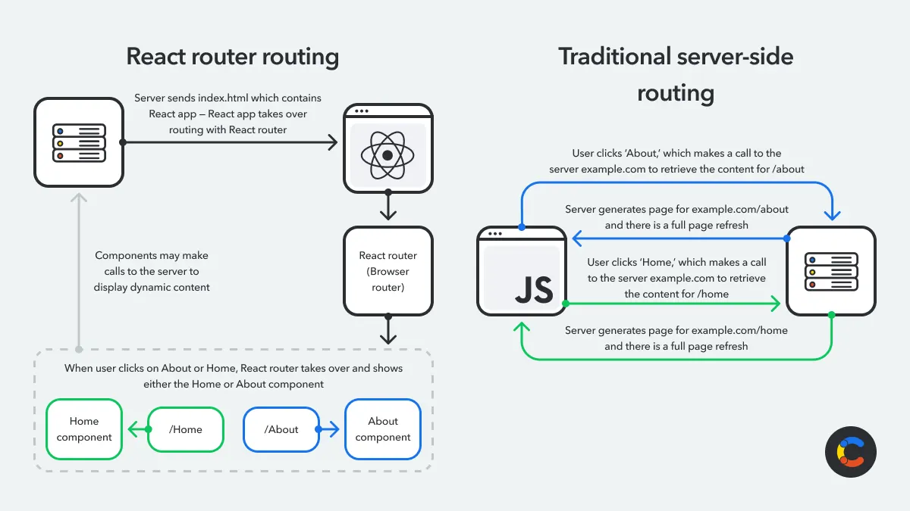

# React Router 

## Background

React is one of the most popular libraries in modern web development for creating user interfaces (UIs). It provides tools for building interactive, reusable components using a component-based architecture. React focuses on building the UI only, so routing (navigating between different views or pages) is not built in — it is supplied by additional libraries like **React Router**.

Routing is essential for anything more than a basic application: it lets users move between different pages of the app while loading the relevant content for each route.

## React Routing Explained

Routing is a mechanism that allows users to navigate between different pages or sections of a web application, usually triggered by a link or button click in the UI.

### Server-side vs. Client-side Routing

Two kinds of routing exist depending on how the application is built and deployed. They evolved to balance performance, interactivity, and user experience.

- **Server-side routing**: Each navigation request triggers a full page reload, fetching and rendering a new HTML document from the server. Effective, but slower due to network latency, full page reloads, and server rendering time.
- **Client-side routing**: Managed directly in the browser with JavaScript. Instead of reloading the entire page, the browser fetches and renders only the content that needs updating. The client-side router simulates a full page reload by deciding which components or views to show based on the route. This is the foundation of **single-page applications (SPAs)**.

Since React is often used to build SPAs, routing in React is typically handled client-side using libraries such as **react-router-dom** (the most popular). Alternatives include **Reach Router** (a lightweight version of React Router) and **Next.js** (designed for server-side rendering and hybrid routing).



### Key Features of react-router-dom

- **Dynamic routes**: Routes defined using UI components, allowing flexibility and easy updates.
- **Nested routes**: Organize and manage complex routing hierarchies for descriptive URLs and maintainability.
- **Route parameters**: Dynamic parameters in URLs, e.g. the ID of a blog post to load (`/blog/:id`).
- **Redirects and guards**: Control user access with redirects or route protection based on conditions.
- **Hooks**: Built-in hooks such as `useNavigate` and `useParams` to simplify route handling.
- **Lazy loading**: Optimize performance by loading components only when needed.

## Types of Routers

React Router provides different router types, each suited to specific use cases.

### BrowserRouter

The most commonly used router for web applications. It uses the HTML5 history API to keep the UI in sync with the URL, producing clean, user-friendly URLs. Use it when your app is hosted on a server that can handle dynamic routes — i.e., the server always serves the same `index.html` for any route and React handles routing entirely on the client.

```jsx
import { BrowserRouter, Routes, Route } from 'react-router-dom';

function App() {
  return (
    // BrowserRouter wraps the application and enables React Router's routing functionality
    <BrowserRouter>
      <Routes>
        <Route path="/" element={<Home />} />
        <Route path="/about" element={<About />} />
      </Routes>
    </BrowserRouter>
  );
}
```

### HashRouter

Uses the hash portion of the URL (e.g. `http://example.com/#/about`) to manage routing. Anything after the `#` is not sent to the server; JavaScript maps it to a component. Ideal when the server cannot handle dynamic routes, when hosting a static site, or when backward compatibility with older browsers is required.

```jsx
import { HashRouter, Routes, Route } from 'react-router-dom';

function App() {
  return (
    // HashRouter uses the URL hash (#) for routing, ensuring compatibility with static file servers
    <HashRouter>
      <Routes>
        <Route path="/" element={<Home />} />
        <Route path="/about" element={<About />} />
      </Routes>
    </HashRouter>
  );
}
```

### MemoryRouter

Stores navigation history in memory rather than syncing with the browser's URL bar. Doesn't affect or rely on the address bar, making it suitable for client-side applications and native apps built with tools like React Native.

```jsx
import { MemoryRouter, Routes, Route } from 'react-router-dom';

// Example pages
const Home = () => <div>Home Page</div>;
const About = () => <div>About Page</div>;

export default function App() {
  return (
    // MemoryRouter keeps the routing state in memory (not reflected in the browser's URL)
    <MemoryRouter>
      <Routes>
        <Route path="/" element={<Home />} />
        <Route path="/about" element={<About />} />
      </Routes>
    </MemoryRouter>
  );
}
```

## Getting Started with react-router-dom

### Installing and Configuring

Install the package:

```bash
npm install react-router-dom
```

Import the necessary components in `App.js` (or your entry file):

```jsx
import { BrowserRouter as Router, Routes, Route } from 'react-router-dom';

// Example pages
const Home = () => <div>Home Page</div>;
const About = () => <div>About Page</div>;

export default function App() {
  return (
    <Router>
      <Routes>
        <Route path="/" element={<Home />} />
        <Route path="/about" element={<About />} />
      </Routes>
    </Router>
  );
}
```

The `<Router>` component wraps your application and provides the routing context. `<Routes>` and `<Route>` define the paths and the components to render for each route. In this example, you must manually edit the URL to switch between routes.

### Navigating with useNavigate

Use the `onClick` event and the `useNavigate` hook to move between routes:

```jsx
import { BrowserRouter as Router, Routes, Route, useNavigate } from 'react-router-dom';

// Home Component: Displays the home page with a button to navigate to the About page
const Home = () => {
  const navigate = useNavigate(); // Hook to programmatically navigate between routes

  return (
    <div>
      <h1>Home Page</h1>
      {/* Button to navigate to the About page */}
      <button onClick={() => navigate('/about')}>Go to About Page</button>
    </div>
  );
};

// About Component: Displays the about page with a button to navigate back to the Home page
const About = () => {
  const navigate = useNavigate();

  return (
    <div>
      <h1>About Page</h1>
      {/* Button to navigate back to the Home page */}
      <button onClick={() => navigate('/')}>Go to Home Page</button>
    </div>
  );
};

// App Component: Defines the main application structure and routes
const App = () => {
  return (
    <Router>
      <Routes>
        <Route path="/" element={<Home />} />
        <Route path="/about" element={<About />} />
      </Routes>
    </Router>
  );
};

export default App;
```

Home is displayed at the default route; both components use `useNavigate` to route between each other.

### Fallback Routes (404)

When a user accesses a route that doesn't exist, show a "page not found" message with a link back home using a fallback route (`path="*"`):

```jsx
const NotFound = () => {
  const navigate = useNavigate();
  return (
    <div>
      <h1>404: Page not found</h1>
      <button onClick={() => navigate('/')}>Go to Home Page</button>
    </div>
  );
};

const App = () => {
  return (
    <Router>
      <Routes>
        <Route path="/" element={<Home />} />
        <Route path="/about" element={<About />} />
        <Route path="*" element={<NotFound />} /> {/* Picks up nonexistent routes */}
      </Routes>
    </Router>
  );
};

export default App;
```

## Key Hooks in React Routing

| Hook | Purpose | Typical use case |
|------|---------|------------------|
| `useNavigate` | Navigate programmatically | Redirect after form submission, etc. |
| `useLocation` | Get the current route information | Check the pathname or route state |
| `useParams` | Access dynamic route parameters | Retrieve values like `/user/:id` |
| `useRoutes` | Define routes dynamically in components | Configure routes programmatically |
| `useSearchParams` | Work with query parameters in the URL | Filter or sort data via queries |

## Protected Routes

Combine hooks and components to make parts of your app inaccessible until a user logs in. (Example only — a real app needs proper security such as token-based authentication.)

```jsx
import { useState } from 'react';
import { BrowserRouter as Router, Routes, Route, Navigate, Link, useLocation, useNavigate } from 'react-router-dom';

// Home Component: Displays the main home page and navigation links
const Home = ({ setAuthenticated }) => {
  const navigate = useNavigate();

  const handleLogout = () => {
    setAuthenticated(false); // Log out the user
    navigate('/');           // Redirect to the home page
  };

  return (
    <div>
      <h1>Home Page</h1>
      <nav>
        <Link to="/">Home</Link> | <Link to="/dashboard">Dashboard</Link> |{' '}
        <button onClick={handleLogout}>Log Out</button>
      </nav>
    </div>
  );
};

// Dashboard Component: A placeholder for a private page
const Dashboard = () => <h1>Dashboard (Private)</h1>;

// Login Component: Displays the login page and redirects after login
const Login = ({ setAuthenticated }) => {
  const navigate = useNavigate();
  const location = useLocation();
  const from = location.state?.from?.pathname || '/'; // The route the user tried to access

  const handleLogin = () => {
    setAuthenticated(true); // Log in the user
    navigate(from);         // Redirect to the intended route or home
  };

  return (
    <div>
      <h1>Login Page</h1>
      <p>You must log in to view the page at {from}</p>
      <button onClick={handleLogin}>Log In</button>
    </div>
  );
};

// Custom PrivateRoute Component: Protects routes that require authentication
const PrivateRoute = ({ isAuthenticated, children }) => {
  const location = useLocation();

  return isAuthenticated ? (
    children // If authenticated, render the protected content
  ) : (
    // Otherwise, redirect to the login page and save the current location
    <Navigate to="/login" state={{ from: location }} replace />
  );
};

// App Component: Main application entry point with routes and authentication state
const App = () => {
  const [isAuthenticated, setAuthenticated] = useState(false);

  return (
    <Router>
      <Routes>
        {/* Public route: Home */}
        <Route path="/" element={<Home setAuthenticated={setAuthenticated} />} />
        {/* Private route: Dashboard */}
        <Route
          path="/dashboard"
          element={
            <PrivateRoute isAuthenticated={isAuthenticated}>
              <Dashboard />
            </PrivateRoute>
          }
        />
        {/* Public route: Login */}
        <Route path="/login" element={<Login setAuthenticated={setAuthenticated} />} />
      </Routes>
    </Router>
  );
};

export default App;
```

How it works: the auth status lives in `isAuthenticated` state, toggled by the login button. `PrivateRoute` wraps `Dashboard` and either renders it or redirects to `Login`. The current location is passed to `Login` via `useLocation` so that after login the user is redirected to their intended destination. `Link` is an alternative to a button with `onClick`; `useNavigate` navigates programmatically without user interaction.

## Dynamic Routing

Dynamic routing creates routes with placeholders that match dynamic URL segments. The `useParams` hook gives access to them.

```jsx
import { BrowserRouter as Router, Routes, Route, Link, useParams } from 'react-router-dom';

const BlogArticle = () => {
  const { blogId } = useParams(); // Extract the dynamic segment from the URL

  // ID can be used to retrieve the article here
  return (
    <div>
      <h1>Blog</h1>
      <p>Blog ID: {blogId}</p>
    </div>
  );
};

const App = () => {
  return (
    <Router>
      <nav>
        <Link to="/blog/1">Blog 1</Link> | <Link to="/blog/2">Blog 2</Link>
      </nav>

      <Routes>
        <Route path="/blog/:blogId" element={<BlogArticle />} />
      </Routes>
    </Router>
  );
};

export default App;
```

The `Link` components pass dynamic `blogId` values to the route; `useParams` extracts the ID in `BlogArticle`, where it could drive a network call to fetch the specific blog post.

## Lazy Loading

Lazy loading loads components only when needed, reducing initial load time. Use `React.lazy` and `React.Suspense` with React Router:

```jsx
import { lazy, Suspense } from 'react';
import { BrowserRouter as Router, Routes, Route, Link } from 'react-router-dom';

// Lazy-loaded components
const Home = lazy(() => import('./Home'));
const About = lazy(() => import('./About'));

const App = () => {
  return (
    <Router>
      <nav>
        <Link to="/">Home</Link> | <Link to="/about">About</Link>
      </nav>

      <Suspense fallback={<div>Loading...</div>}>
        <Routes>
          <Route path="/" element={<Home />} />
          <Route path="/about" element={<About />} />
        </Routes>
      </Suspense>
    </Router>
  );
};

export default App;
```

## SEO Considerations

Search engine crawlers rely on fully rendered HTML to index pages. Since React handles routing client-side, it initially serves a minimal HTML file, with content rendered dynamically in the browser. This can lead to incomplete or poor indexing if crawlers can't execute JavaScript efficiently or rendering is delayed — making SPAs with client-side routing hard to optimize for search engines.

If SEO matters, consider a framework like **Next.js**, which uses server-side rendering (SSR) to pre-render pages before sending them to the browser, so crawlers receive fully rendered HTML.

## React Routing and App Frameworks (Next.js)

Frameworks like Next.js simplify routing with **file-based routing** — routes are created from the file structure without extra configuration. You can build nested routes easily, fine-tune route behavior with middleware, and add params to filenames for dynamic routing.

## Building with Contentful

Pairing react-router-dom with a composable content platform like **Contentful** works well for content-heavy websites: compose your back end quickly, manage routing and dynamic content, and deliver personalized experiences globally.

Combining React routing and lazy loading with Contentful's REST and GraphQL APIs builds fast, responsive, content-driven applications — lazy-loaded routes cut initial load time while Contentful delivers content from edge locations via its globally distributed CDN. Contentful offers a React starter app pre-configured for Contentful, and a Next.js starter optimized for SSR and dynamic content fetching.