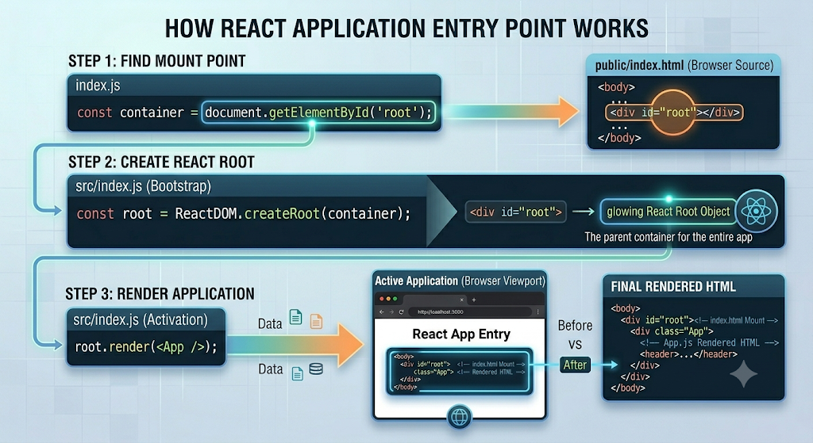
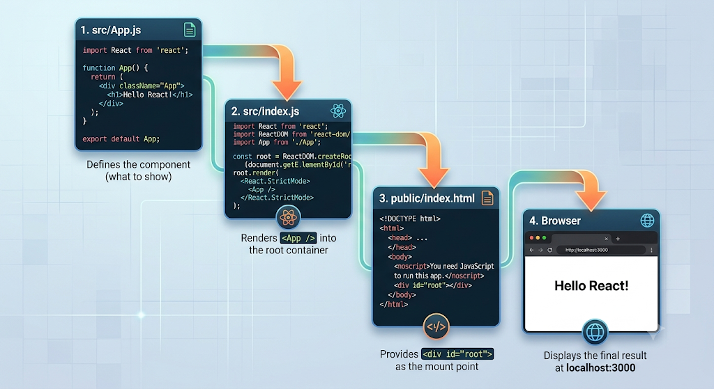
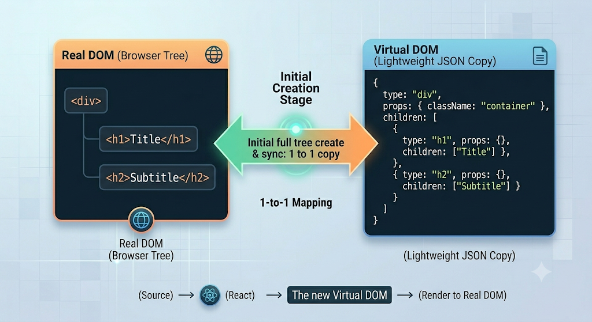
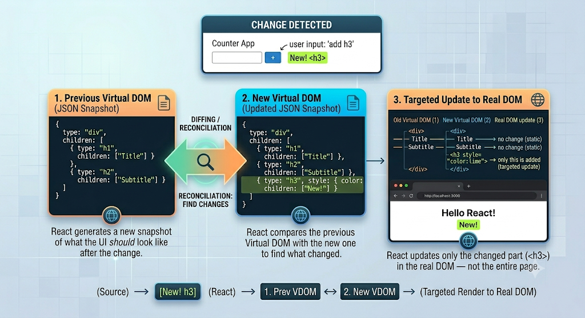

# Setting Up and Understanding a React App

---

## Prerequisites

Before creating a React app, you need two tools installed on your machine:

- **Node.js** — the JavaScript runtime environment
- **npm** (Node Package Manager) — comes bundled with Node.js, used to install and run packages

### Verify Node is Installed

Open your terminal and run:

```bash
node -v
```

If Node is installed, you'll see a version number like `20.11.0`. If you see an error like `node is not recognized`, download and install Node from [nodejs.org](https://nodejs.org).

---

## Creating a React App

There are two main ways to create a React app. **Vite** is the modern recommended approach; **Create React App (CRA)** is the older method.

### Option A — Using Vite (Recommended)

Vite is a modern build tool that provides lightning-fast startup and an optimized development experience. It is the preferred choice for new React projects.

```bash
# Create a new React app with Vite
npm create vite@latest my-react-app -- --template react

# Move into the project folder
cd my-react-app

# Install dependencies
npm install

# Start the development server
npm run dev
```

Open your browser and go to `http://localhost:5173` — Vite uses port `5173` by default.

### Option B — Using Create React App (CRA — Deprecated)

CRA is the older method. It still works but is no longer the recommended approach for new projects. Prefer Vite or Next.js for modern projects.

```bash
# Create in a new subfolder
npx create-react-app my-app

# Create directly in the current folder
npx create-react-app .
```

> **App name rules:** Names must be lowercase — no capital letters or spaces. Use hyphens: `my-app` not `My App`.

### Running the App

| Tool | Start command | Local URL |
|---|---|---|
| Vite | `npm run dev` | `http://localhost:5173` |
| CRA | `npm start` | `http://localhost:3000` |

> **What is localhost?** When developing locally, your code runs on your own machine — not a public server. `localhost` is the address for your own computer. The number after the colon is the port. You haven't deployed anything to the internet yet.

---

## The Project Folder Structure

When `create-react-app` finishes, it generates this structure:

```
my-app/
├── public/
│   ├── index.html          ← the only HTML file in the entire app
│   └── favicon.ico
├── src/
│   ├── BookApp.js              ← the main component you edit
│   ├── App.css
│   ├── index.js            ← entry point — connects React to the HTML
│   └── index.css
├── package.json            ← lists all dependencies and scripts
└── node_modules/           ← all installed packages (do not edit)
```

The two most important files to understand are `public/index.html` and `src/index.js`.

---

## How a React App Renders — The Connection Explained

This is the most important concept to understand before writing any React code.

### Step 1 — `public/index.html`

This is the only HTML file in the entire app. When React loads in the browser, this is what gets served. If you open it, you'll see it's almost empty:

```html
<!DOCTYPE html>
<html lang="en">
  <head>
    <meta charset="UTF-8" />
    <title>React App</title>
  </head>
  <body>
    <noscript>You need to enable JavaScript to run this app.</noscript>

    <div id="root"></div>
    <!-- Everything React renders goes inside this div -->

  </body>
</html>
```

The critical line is:

```html
<div id="root"></div>
```

This empty `div` with the id `"root"` is the **container** — the parent element where React will inject the entire application. React does not touch anything else in this file.

You can customize this file:
- Change the `<title>` to rename the browser tab
- Replace the favicon with your own logo
- Change the meta tags for SEO

### Step 2 — `src/index.js`

This is the **entry point** of the React application. It is the bridge between `index.html` and all your React components:

```js
import React from 'react';
import ReactDOM from 'react-dom/client';
import App from './App';

// 1. Find the <div id="root"> in index.html
const root = ReactDOM.createRoot(document.getElementById('root'));

// 2. Render the App component inside it
root.render(<App />);
```

**How it works step by step:**

1. `document.getElementById('root')` finds the empty `<div id="root">` in `index.html`
2. `ReactDOM.createRoot()` turns that div into a React root — the parent container for the entire app
3. `root.render(<App />)` takes the `App` component and injects all its HTML into that root div

So the final rendered HTML in the browser looks like this:

```html
<body>
  <div id="root">          <!-- from index.html -->
    <div class="App">      <!-- from BookApp.js -->
      <header>...</header>
    </div>
  </div>
</body>
```

> **Key insight:** There is no HTML written in `index.html` for your actual content. All the content comes from your React components and gets injected into the `<div id="root">` at runtime.



### Step 3 — `src/BookApp.js`

This is the main component — the one that `index.js` renders. It's a **functional component**: a JavaScript function that returns HTML-like syntax (called JSX):

```jsx
function App() {
  return (
    <div className="App">
      <header className="App-header">
        
        <p>
          Edit <code>src/BookApp.js</code> and save to reload.
        </p>
      </header>
    </div>
  );
}

export default App;
```

When you edit `BookApp.js` and save, the browser **automatically updates** — you don't need to refresh manually. This is called **Hot Module Replacement**.

---

## The Full Rendering Flow



Everything you see in the browser starts in `BookApp.js`, gets passed through `index.js`, and lands inside the `<div id="root">` in `index.html`.

---

## Your First React Program — "Hello, World!" Explained

```jsx
import React from 'react';

function App() {
  return (
    <div>
      <h1>Hello, World!</h1>
    </div>
  );
}

export default App;
```

Breaking down each line:

| Line | What it does |
|---|---|
| `import React from 'react'` | Imports React to enable JSX and component creation |
| `function App() { ... }` | Defines a functional component called `App` |
| `return ( ... )` | Returns JSX — the UI the component renders (a `div` with an `h1`) |
| `export default App` | Exports the component so it can be imported and used elsewhere |

---

## How the Virtual DOM Works — Reconciliation

React's Virtual DOM is what makes UI updates efficient. Here is the step-by-step process:

**Initial State:**



**When a change occurs (e.g. adding `<h3>`):**

1. **New Virtual DOM is created** — React generates a new snapshot of what the UI should look like after the change
2. **Diffing / Reconciliation** — React compares the previous Virtual DOM with the new one to find what changed
3. **Targeted update** — React updates only the changed part (`<h3>`) in the real DOM — not the entire page



Without the Virtual DOM, any state change would re-render the entire page — inefficient for large applications.

---

Open `src/BookApp.js` and add an `<h1>` tag inside the header:

```jsx
function App() {
  return (
    <div className="App">
      <header className="App-header">
        <h1>My React App</h1>
        <p>Edit BookApp.js and save to see changes instantly.</p>
      </header>
    </div>
  );
}
```

Save the file. The browser updates immediately without a manual refresh. Whatever you write inside the `return()` is what gets rendered on the screen.

---

## Renaming a Component

Component names can be anything — but they must start with a capital letter. Here is how to rename `App` to `MyApp`:

**In `src/BookApp.js`:**

```jsx
// Change the function name
function MyApp() {
  return (
    <div className="App">
      <h1>My React App</h1>
    </div>
  );
}

// Update the export
export default MyApp;
```

**In `src/index.js`:**

```js
import MyApp from './App'; // update the import name

const root = ReactDOM.createRoot(document.getElementById('root'));
root.render(<MyApp />); // use the new name here
```

The app works exactly the same — the name only matters for internal reference.

---

## Changing the Root ID

The `id="root"` in `index.html` is just a convention — you can change it to any name, as long as `index.js` matches:

**`public/index.html`:**

```html
<div id="app-container"></div>
```

**`src/index.js`:**

```js
const root = ReactDOM.createRoot(document.getElementById('app-container'));
```

Both point to the same element — React doesn't care what the id is called, as long as they match.

---

## What is a Functional Component?

A **functional component** is a JavaScript function that:
- Has a name starting with a capital letter
- Returns JSX (HTML-like markup)

```jsx
// This is a functional component
function Navbar() {
  return (
    <nav>
      <a href="/">Home</a>
      <a href="/about">About</a>
    </nav>
  );
}
```

To use a component inside another component, write it like an HTML self-closing tag:

```jsx
function App() {
  return (
    <div>
      <Navbar />      {/* using Navbar component */}
      <main>Content here</main>
    </div>
  );
}
```

This is how all React apps are built — by composing small components into larger ones.

---

## `package.json` — The Project's Dependency List

`package.json` lists everything the project depends on:

```json
{
  "dependencies": {
    "react": "^18.2.0",
    "react-dom": "^18.2.0",
    "react-scripts": "5.0.1"
  },
  "scripts": {
    "start": "react-scripts start",
    "build": "react-scripts build"
  }
}
```

- `react` — the core React library
- `react-dom` — tools for rendering React to the browser DOM
- `react-scripts` — the scripts that power `npm start`, `npm run build`, etc.

The `node_modules` folder contains all of these installed packages. Never edit it manually.

---

## Key Commands

| Command | What it does |
|---|---|
| `npx create-react-app my-app` | Creates a new React project in a folder called `my-app` |
| `npx create-react-app .` | Creates the React project in the current folder |
| `npm start` | Starts the development server at `localhost:3000` |
| `npm run build` | Builds a production-ready version of the app |
| `node -v` | Checks if Node.js is installed and shows the version |

---

## Summary

- A React app has one HTML file (`public/index.html`) with a single `<div id="root">` — all content is injected here by React
- `src/index.js` is the entry point — it connects React to the HTML by calling `ReactDOM.createRoot()` and `root.render()`
- `src/BookApp.js` is the main component — the starting point of your actual UI
- A **functional component** is a JavaScript function that returns JSX — it must be named with a capital letter
- Components are used like HTML tags: `<Navbar />`, `<App />`, `<ProductCard />`
- Editing `BookApp.js` and saving instantly updates the browser — no manual refresh needed
- Everything flows: `BookApp.js` → `index.js` → `index.html` → browser

---