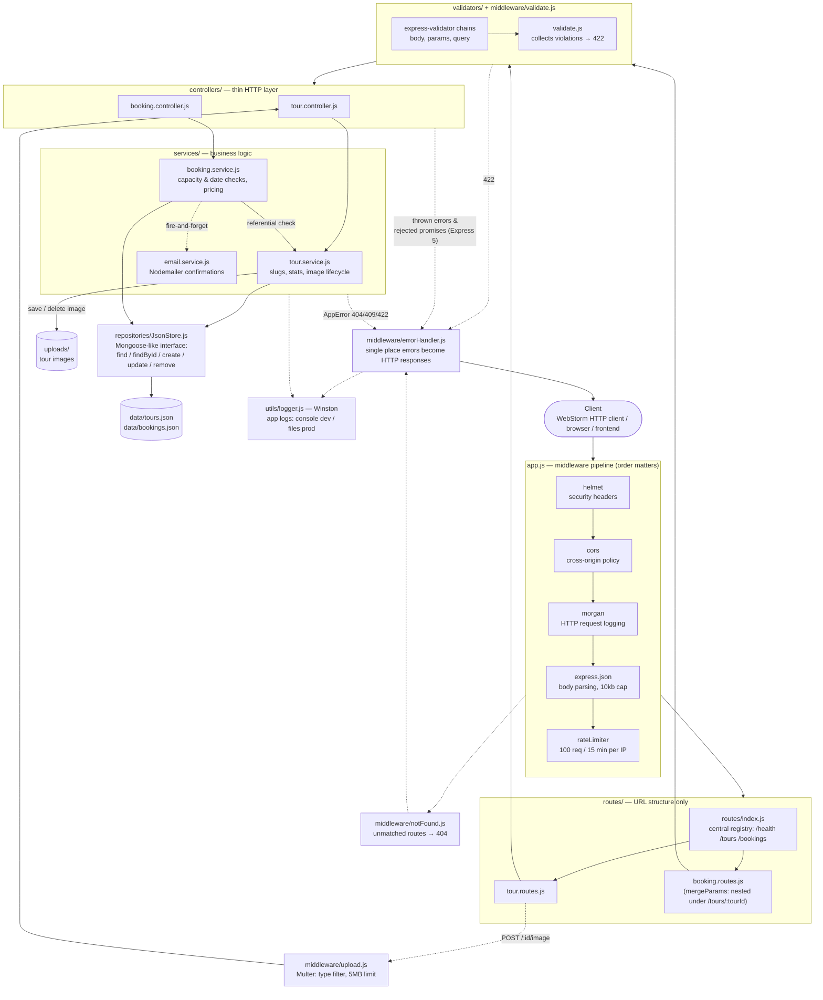
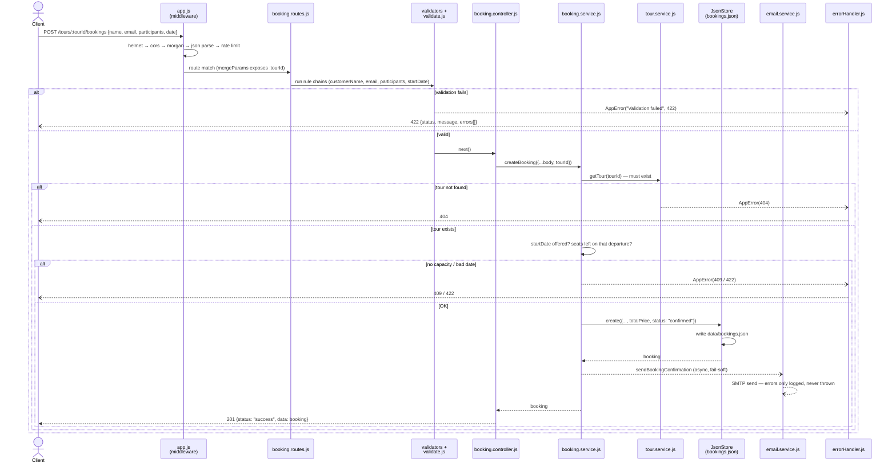

# Tour & Travel REST API

Express 5 REST API for a tour & travel business, built with a layered architecture and current best practices. Data persists to JSON files (no database required), behind a repository layer designed so MongoDB/Mongoose can be swapped in later without touching routes, controllers, or services.

## Quick start

```bash
npm install
npm run dev        # auto-restarts on change (node --watch)
# or
npm start
```

Server: `http://localhost:3000/api/v1` — open `requests.http` in WebStorm and run requests directly from the IDE.

## Architecture — information flow

Every request passes through the same pipeline. Each layer has exactly one job and only talks to the layer directly below it; errors from any depth flow back to the single global error handler.



### Sequence diagram — `POST /api/v1/tours/:tourId/bookings`

The most involved flow in the project, end to end:



## File-by-file guide

### Entry points

| File | What it does |
|---|---|
| `src/server.js` | Process-level concerns only: starts the HTTP listener, handles graceful shutdown (`SIGTERM`) and crash safety (`unhandledRejection`, `uncaughtException`). Knows nothing about routes. |
| `src/app.js` | Assembles the Express app: sets the `extended` query parser (needed in Express 5 for `?price[lte]=2000`), wires the global middleware pipeline in order (helmet → cors → morgan → json → rate limit), serves `/uploads` statically, mounts the API router, and registers the 404 + error handlers last. Exported separately from `server.js` so tests can import the app without opening a port. |

### Configuration

| File | What it does |
|---|---|
| `src/config/index.js` | Loads `.env` via dotenv and exposes one frozen config object (port, API prefix, CORS origin, rate limits, log level, upload size cap, SMTP settings). No other file reads `process.env` directly — 12-factor config in one place. |
| `.env` / `.env.example` | Environment variables per environment. `.env` is gitignored; `.env.example` documents every variable. Defaults work with zero setup. |

### Routes — URL structure only

| File | What it does |
|---|---|
| `src/routes/index.js` | Central route registry: mounts `/health`, `/tours`, `/bookings` under the API prefix. Adding a resource means one line here. |
| `src/routes/tour.routes.js` | Tour endpoints. Declares the order-sensitive parts: static `/stats` before dynamic `/:id`, nested mount of the booking router at `/:tourId/bookings`, and the Multer-backed `POST /:id/image`. No logic — just wiring of validators → validate → controller. |
| `src/routes/booking.routes.js` | Booking endpoints. Created with `Router({ mergeParams: true })` so the same file serves both `/bookings` and `/tours/:tourId/bookings` (the nested form sees `:tourId`). |

### Validators — reject bad input at the edge

| File | What it does |
|---|---|
| `src/validators/tour.validators.js` | express-validator rule chains for tours: `createTour` (all fields required, difficulty whitelist, ISO dates), `updateTour` (same rules, all optional — PATCH semantics), `idParam` (UUID check). |
| `src/validators/booking.validators.js` | Rule chains for bookings: customer name/email (normalized), participants range, ISO `startDate`, and `tourId` accepted from body **or** nested route param. |
| `src/validators/query.validators.js` | Shared `listQuery` rules for list endpoints: `page ≥ 1`, `1 ≤ limit ≤ 100`, `sort`/`fields` shape. Validates the query string, not just the body. |
| `src/middleware/validate.js` | The single checkpoint after any rule chain: collects violations from `validationResult` and forwards one structured `AppError(422)` with a `{field, message}` list. Controllers never see invalid input. |

### Controllers — thin HTTP translation

| File | What it does |
|---|---|
| `src/controllers/tour.controller.js` | Maps HTTP to service calls for tours: list/get/create/update/delete, `/stats`, and image upload. Sets correct semantics: `201 + Location` on create, `204` on delete. Async — Express 5 forwards rejections to the error handler, so no try/catch. |
| `src/controllers/booking.controller.js` | Same for bookings: resolves `tourId` from the nested param or body, delegates to the service, shapes the JSON envelope (`status`, `results`, `pagination`, `data`). |

### Services — business logic

| File | What it does |
|---|---|
| `src/services/tour.service.js` | All tour rules: slug generation from the name, defaults on create, aggregate stats grouped by difficulty (the JSON equivalent of a Mongo aggregation), and the image lifecycle — attaching an upload, deleting the old file on replace, cleaning up on tour delete, removing orphans if the tour didn't exist. |
| `src/services/booking.service.js` | All booking rules: the tour must exist (referential integrity), the departure date must be one the tour offers (422), seats remaining on that departure must cover the request (409), price computed server-side from the tour — never trusted from the client. Triggers the confirmation email without awaiting it. |
| `src/services/email.service.js` | Nodemailer wrapper. Lazily builds the transporter: real SMTP when `SMTP_HOST` is set, otherwise an Ethereal test account (emails are captured, preview URL logged, nothing delivered). `sendBookingConfirmation` is fail-soft: an SMTP outage logs a warning but never fails the booking. HTML template lives here, out of the business logic. |

### Repository — persistence behind an interface

| File | What it does |
|---|---|
| `src/repositories/JsonStore.js` | Tiny persistence layer: an in-memory collection lazily loaded from `data/<name>.json`, written back on every mutation. Exposes a Mongoose-like interface (`find`, `findById`, `create`, `update`, `remove`), generates UUIDs and `createdAt`/`updatedAt` timestamps, and protects `id`/`createdAt` from being overwritten. Swap this one class for Mongoose models and nothing above it changes. |
| `data/tours.json` | Seed/live tour data. |
| `data/bookings.json` | Live booking data. |

### Middleware

| File | What it does |
|---|---|
| `src/middleware/upload.js` | Multer configuration: disk storage into `uploads/` (created on startup), unique safe filenames (`tour-<id>-<uuid>.<ext>` — never trusts `originalname`), file filter checking **both** mimetype and extension against an image whitelist, 5MB size limit. |
| `src/middleware/rateLimiter.js` | express-rate-limit: 100 requests per IP per 15-minute window (both configurable) on all `/api` routes, with standard `RateLimit-*` headers. |
| `src/middleware/notFound.js` | Catch-all after every route: turns unmatched URLs into `AppError(404)` so even "route not found" goes through the one error pipeline. |
| `src/middleware/errorHandler.js` | The single place errors become HTTP responses. Normalizes special cases (malformed JSON → 400, Multer errors → 400 with friendly messages), distinguishes operational errors (safe to show) from programmer errors (logged with stack via Winston, hidden behind "Something went wrong" in production). |

### Utils

| File | What it does |
|---|---|
| `src/utils/AppError.js` | Operational error class: message + HTTP status + optional details, `status` derived as `fail` (4xx) or `error` (5xx), `isOperational` flag the error handler uses to decide how much to reveal. |
| `src/utils/apiFeatures.js` | The list-endpoint pipeline shared by tours and bookings: exact-match filtering, `gte/gt/lte/lt` operators (`?price[lte]=2000`), multi-key sorting (`?sort=-price,name`), sparse fieldsets (`?fields=name,price`), and pagination with metadata. |
| `src/utils/logger.js` | Winston application logger (Morgan handles HTTP logs; this handles everything else). Env-aware transports: colored console in development, rotated JSON files in production (`logs/error.log` always, `logs/combined.log` in prod). |

### Tooling

| File | What it does |
|---|---|
| `requests.http` | Ready-made requests for the WebStorm HTTP client covering every endpoint, including error cases and the image upload. |
| `package.json` | Dependencies and scripts: `npm run dev` uses Node's built-in `--watch` (no nodemon needed). |
| `.gitignore` | Excludes `node_modules`, `.env`, `logs/`, `uploads/`. |

## Endpoints

| Method | Path | Description |
|---|---|---|
| GET | `/api/v1/health` | Health/uptime check |
| GET | `/api/v1/tours` | List tours (filter, sort, paginate, field-limit) |
| POST | `/api/v1/tours` | Create tour (validated) |
| GET | `/api/v1/tours/stats` | Aggregate stats grouped by difficulty |
| GET | `/api/v1/tours/:id` | Get one tour |
| PATCH | `/api/v1/tours/:id` | Partial update |
| DELETE | `/api/v1/tours/:id` | Delete (204) |
| POST | `/api/v1/tours/:id/image` | Upload tour image (multipart, field `image`) |
| GET | `/uploads/:filename` | Serve uploaded images (static) |
| GET | `/api/v1/tours/:tourId/bookings` | Bookings for one tour (nested route) |
| POST | `/api/v1/tours/:tourId/bookings` | Book that tour |
| GET | `/api/v1/bookings` | List all bookings |
| POST | `/api/v1/bookings` | Create booking (tourId in body) |
| GET | `/api/v1/bookings/:id` | Get one booking |
| PATCH | `/api/v1/bookings/:id/cancel` | Cancel a booking |

### Query features on list endpoints

```
/tours?destination=Kenya&difficulty=easy      exact-match filtering
/tours?price[lte]=2000&durationDays[gte]=5    gte/gt/lte/lt operators
/tours?sort=-price,name                        multi-key sort (- = desc)
/tours?fields=name,price,destination           sparse fieldsets
/tours?page=2&limit=5                          pagination (+ metadata in response)
```

## Best practices demonstrated

- **Layered architecture** — routes / controllers / services / repository, each with one job
- **API versioning** — everything under `/api/v1`
- **Express 5 async error handling** — rejected promises auto-forward to error middleware, no try/catch wrappers
- **Centralized error handling** — one `AppError` class + one global handler; operational vs programmer errors; stack traces hidden in production
- **Validation at the edge** — `express-validator` chains for body, params AND query + a single `validate` middleware returning structured 422s
- **File uploads (Multer)** — mimetype+extension filtering, size limits, unique safe filenames, static serving, orphan-file cleanup on replace/delete
- **Logging** — Morgan for HTTP (`dev` in development, `combined` to `logs/access.log` in production) + Winston for application logs (levels, JSON format, rotated files, env-aware transports)
- **Transactional email (Nodemailer)** — booking confirmations; Ethereal fake SMTP in development (preview URL logged, nothing actually sent), real SMTP via env vars in production; fail-soft so bookings never fail on email errors
- **Security** — `helmet` headers, configurable CORS, rate limiting, 10kb JSON body cap
- **Correct HTTP semantics** — 201 + Location on create, 204 on delete, 404/409/422 where each applies, PATCH for partial updates
- **Business rules in services** — booking capacity checks per departure date, referential integrity to tours, prices computed server-side
- **Nested resources** — `Router({ mergeParams: true })` for `/tours/:tourId/bookings`
- **12-factor config** — all settings via environment variables (`.env.example` documents them)
- **Graceful shutdown** — SIGTERM/unhandledRejection/uncaughtException handled in `server.js`

## Environment variables

See `.env.example`. Defaults work out of the box; nothing is required to start.

## Swapping in MongoDB later

Replace `repositories/JsonStore.js` with Mongoose models exposing the same methods (`find`, `findById`, `create`, `update`, `remove`). Services and everything above them stay unchanged.
