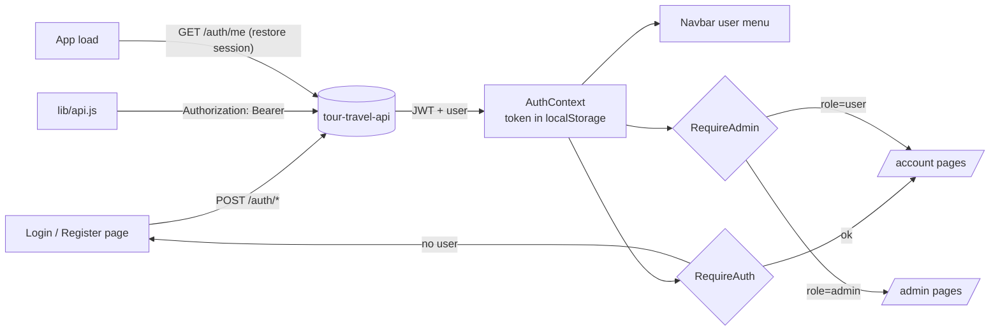

# Tour & Travel UI

React + Tailwind front end for tour-travel-api: public tourism site, user account area, and admin panel — implementing `wireframes/wireframes.html` with the Figma visual identity (black / #f8cc07 / Inter + Jeju Hallasan).

## Run it

```bash
# 1. One-time: fetch design images from Figma (URLs valid ~7 days)
bash download-assets.sh

# 2. Backend (in ../tour-travel-api)
npm run dev

# 3. UI
npm install
npm run dev        # → http://localhost:5173
```

**Seeded admin login:** `gouma308@gmail.com` / `Admin123!` — change it after first login (Profile → Change password). New registrations get the `user` role.

## Stack

Vite 6 · React 18 · React Router 7 · Tailwind CSS v4. JWT stored client-side; Vite proxies `/api` and `/uploads` to `localhost:3000`.

## Pages

| Route | Page | Access | API |
|---|---|---|---|
| `/` | Landing: search-first hero, trust stats, featured tours, why-us, reviews, newsletter | public | `GET /tours`, `GET /tours/stats` |
| `/tours` | Listing: filters (destination, difficulty, max price), sort, pagination — all URL-driven | public | `GET /tours?…` query features |
| `/tours/:id` | Detail: gallery, departures, sticky booking card | public | `GET /tours/:id` |
| `/checkout` | Guest or logged-in checkout, inline 422/409 errors | public | `POST /bookings` |
| `/confirmation` | Booking receipt + account prompt for guests | public | — |
| `/login`, `/register` | Auth; admin logins land on `/admin` | public | `POST /auth/login`, `POST /auth/register` |
| `/account` | My bookings: upcoming/past/cancelled tabs, cancel action | user | `GET /bookings/mine`, `PATCH /bookings/:id/cancel` |
| `/account/profile` | Edit name, change password | user | `PATCH /users/me`, `PATCH /users/me/password` |
| `/admin` | KPIs, revenue-by-month + difficulty charts, recent bookings | admin | `GET /bookings/stats`, `GET /tours/stats` |
| `/admin/tours` | Tours CRUD + image upload (modal form) | admin | `POST/PATCH/DELETE /tours`, `POST /tours/:id/image` |
| `/admin/bookings` | All bookings: filters + CSV export | admin | `GET /bookings` |
| `/admin/users` | Role & activation management | admin | `GET /users`, `PATCH /users/:id/role`, `/active` |
| `*` | 404 | public | — |

## Auth flow



Route guards wait for the initial `/auth/me` check (`ready` flag) to avoid redirect flicker on refresh.
